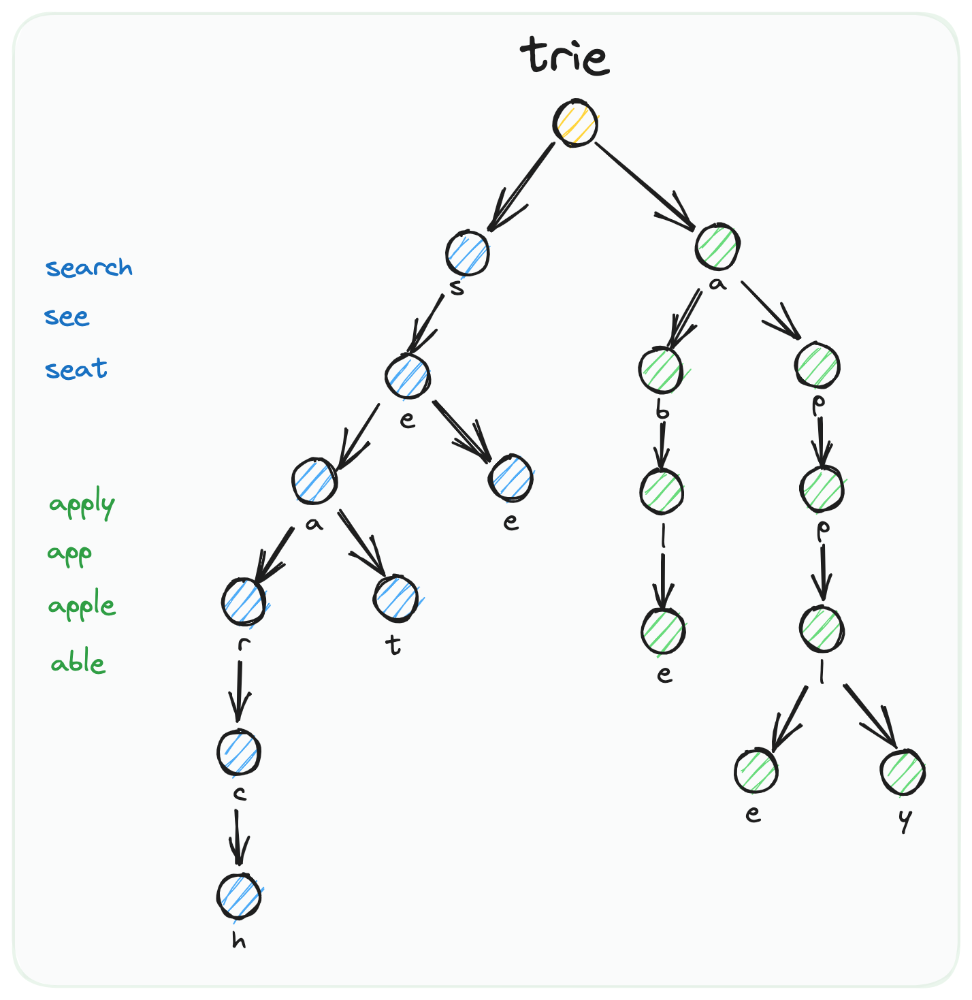
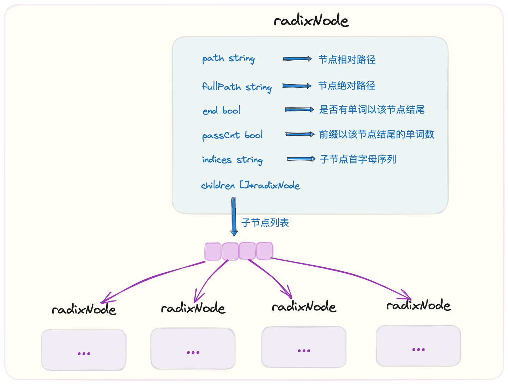
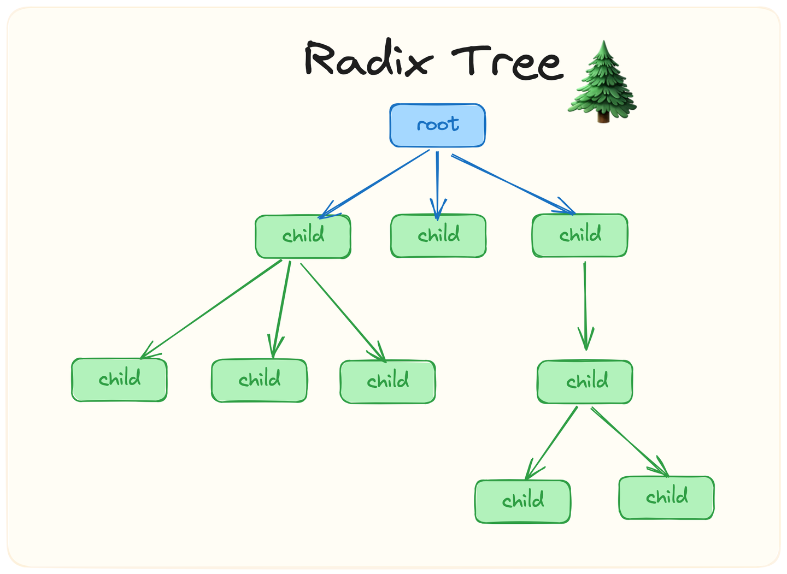

## 1 前缀树 Trie 概述

### 1.1 Trie 概念介绍

前缀树 Trie，又称为字典树或者单词查找树，是一种广泛应用于文本词频统计和搜索场景的树存储结构。

Trie 本身是一个多叉树结构，树中的每个节点存储一个字符。它与普通树数据结构最大的差异在于，存储数据的 key 不存放于单个节点中，而是由从根节点 root 出发直到抵达目标节点 target node 之间的沿途路径组成。基于这样的构造方式，拥有相同前缀的字符串可以复用公共的父节点，直到在首次出现不同字符的位置才出现节点分叉，最终形成多叉树结构。

下面我们通过一个案例加以说明：



如上图所示，我们描述一下插入 search、see、seat 三个单词的流程：

- 首先，Trie 的根节点 root 内容为空。root 是所有节点的祖先、所有路径的起点
- 由于三个单词都有着公共的前缀 se，因此共享父节点 s、e
- 接下来，see 由于第三个字符为 e，与其他两个单词不同，因此 see 单独分叉出节点 e
- seat、search 由于第三个字符都为 a，因此共享节点 a
- seat、search 从第四个字符开始分叉，seat = sea + t；search = sea + r + c + h

回顾其结构特征，我们可以看出，Trie 的优势是当存储拥有公共前缀的内容时，可以在很大程度上节省空间提高空间利用率。同时由于这种公共前缀的设计方式，也赋予了 Trie 能够支持前缀频率统计以及前缀模糊匹配的功能。

### 1.2 Trie 应用介绍

基于 Trie 的特性，有一类很常用的应用场景就是搜索提示。比如当输入一个网址时，可以通过 Trie 识别出用户可能的输入；当没有完全匹配的搜索结果时，也可以基于前缀返回最相似的可能输入。

除此之外，Trie 存在另一个让我印象深刻的使用案例——GeoHash 算法。

简单来讲，GeoHash 是一种地址编码方式，通过将经纬度二维坐标通过递归二分的方式压缩成一个一维字符串，并能够在很大程度上保证拥有越长公共前缀的两个字符串之间的相对距离就越小。

由于 GeoHash 这种基于公共前缀圈定距离的实现方式，因此我们在存储基于 GeoHash 生成的大量位置信息时，通常会优先考虑使用 Trie 树作为实现的数据结构。


上图是 GeoHash 实现思路的简单示例。

## 2 前缀树 Trie 实现

### 2.1 LeetCode 试题

针对前缀树，大家不妨使用 LeetCode 上的一道编程算法题来练练手：

- 题号：208
- 题名：实现 Trie（前缀树）

### 2.2 核心数据结构

下面，我们就进入实战环节，一起通过 Go 语言来从零到一实现一棵 Trie 树：


首先针对 Trie 树中的节点 node，我们进行类型定义：

```go
const alphabetSize = 26

type trieNode struct {
	// nexts 存储指向子节点的指针数组。
	// 数组的索引 'a' -> 0, 'b' -> 1, ...
	// alphabetSize 限定了字符集的大小，这里仅支持小写英文字母。
	nexts   [alphabetSize]*trieNode
	passCnt int
	end     bool
}
```

`trieNode` 中包含几个核心字段：

- `passCnt`：记录通过当前节点的单词数量。即，从根节点到当前节点所形成字符串作为前缀的单词数量
- `end`：标识是否存在单词以当前节点为结尾。即，存在以从根节点到当前节点所形成字符串作为内容的单词
- `nexts`：子节点列表。Trie 树通过这一字段，形成了父子节点一对多的映射关系，最终形成了多叉树的拓扑结构

在本轮实现中，我们将单词的字符限定为 a-z 组成的 26 个小写字母。在每个节点对应的 nexts 切片中，`nexts[0]` 表示下一个节点对应字符为 `'a'`，`nexts[1]` 对应为 `'b'`，以此类推，直到 `nexts[25]` 对应为 `'z'`。


下面是关于前缀树 Trie 的定义，Trie 中需要持有一个根节点 root 即可。其中 root 是所有 trieNode 节点的祖先，其本身对应的字符为空。

```go
type Trie struct {
    root *trieNode
}

func NewTrie() *Trie {
    return &Trie{
        root: &trieNode{},
    }
}
```

### 2.3 查询流程

下面我们展示一下，检索一个单词，判断其是否存在于 Trie 树的处理流程：

```go
func (t *Trie) Search(word string) bool {
    // 查找目标节点，使得从根节点开始抵达目标节点沿路字符形成的字符串恰好等于 word
    node := t.search(word)
    return node != nil && node.end
}
```

- `Trie.Search` 方法通过调用 `Trie.search` 方法，查找满足从根节点开始到抵达该节点所形成字符串恰好等于检索单词 `word` 的目标节点
- 如果节点存在，并且节点的 `end` 标识为 `true`，代表 `word` 存在


下面是 `Trie.search` 方法的源码：
```go
func (t *Trie) search(target string) *trieNode {
    // 从根节点出发移动指针
    move := t.root
    // 依次遍历 target 中的每个字符
    for _, ch := range target {
        // 倘若 nexts 中不存在对应于这个字符的节点，说明该单词没插入过，返回 nil
        if move.nexts[ch-'a'] == nil {
            return nil
        }
        // 指针向着子节点移动
        move = move.nexts[ch-'a']
    }

    // 来到末尾，说明已经完全匹配好单词，直接返回这个节点
    // 需要注意，找到目标节点不一定代表单词存在，因为该节点的 end 标识未必为 true
    // 比如我们之前往 trie 中插入了 apple 这个单词，但是查找 app 这个单词时，预期的返回结果应该是不存在，此时就需要使用到 end 标识进行区分
    return move
}
```

在 `Trie.search` 方法中：

- 移动指针 `move` 从 trie 的根节点 `root` 出发
- 依次遍历 `word` 中的字符，查看 `move` 的子节点列表 `nexts` 中是否存在对应于该字符的子节点
- 如果对应子节点不存在，说明目标不存在
- 如果子节点存在，则将 `move` 指向该子节点，开始下一轮遍历
- 当遍历结束时，此时 `move` 对应的一定是 `target` 末尾的字符，直接返回 `move` 指向的节点
- 在外层方法 `Trie.Search` 中，会通过该节点的 `end` 标识，判断是否存在单词以该节点作为结尾

### 2.4 前缀匹配流程

下面是查看 trie 中是否存在单词以指定 prefix 作为前缀的处理流程。

在 `StartsWith` 方法中，通过调用 `trie.search` 方法，返回全路径对应为 `prefix` 的节点。根据该节点存在与否，可以判断出是否存在单词包括 `prefix` 前缀。

`StartsWith` 流程与 `Search` 流程的区别在于，`StartsWith` 无需对节点的 `end` 标识进行判断，因为此时我们的查询条件更宽松，只需要作前缀匹配，而非精确匹配。

```go
func (t *Trie) StartsWith(prefix string) bool {
    return t.search(prefix) != nil
}
```

### 2.5 前缀统计流程

下面展示一下 Trie 树的另一种用法：给定一个 prefix，要求统计出以 prefix 作为前缀的单词数量。

```go
func (t *Trie) PassCnt(prefix string) int {
    node := t.search(prefix)
    if node == nil {
        return 0
    }
    return node.passCnt
}
```

关于这一点，我们保证在后续处理单词插入的 `Insert` 流程以及单词删除的 `Erase` 流程中，对每个节点维护好一个 `passCnt` 计数器，用于记录通过该节点的单词数量。

因此在此处的 `PassCnt` 流程中，我们只需要根据 `prefix` 找到对应节点，然后直接返回节点对应的 `passCnt` 值即可。

### 2.6 插入流程


下面展示了将一个单词 word 插入到 Trie 树对应流程的实现源码：

```go
func (t *Trie) Insert(word string) {
    move := t.root
    move.passCnt++

    for _, ch := range word {
        i := ch - 'a'
        if move.nexts[i] == nil {
            move.nexts[i] = &trieNode{}
        }
        move = move.nexts[i]
        move.passCnt++
    }

    move.end = true
}
```

流程核心步骤包括：

- 插入新单词时，我们从根节点开始遍历。
- 依次遍历 `word` 的每个字符，如果对应的子节点不存在，则创建新节点。
- 每经过一个节点（包括根节点），都将其 `passCnt` 计数器 +1。
- 遍历结束后，将最后一个节点的 `end` 标志置为 `true`，表示一个单词在此结束。这个实现也优雅地处理了重复插入的情况。

### 2.7 删除流程

最后展示一下从前缀树 Trie 中删除某个单词对应的实现源码：

```go
func (t *Trie) Erase(word string) bool {
    if !t.Search(word) {
        return false
    }

    move := t.root
    move.passCnt--

    for _, ch := range word {
        i := ch - 'a'
        // 如果子节点的 passCnt 减为 0，说明没有其他单词共享这个前缀，可以直接删除
        if move.nexts[i].passCnt-1 == 0 {
            move.nexts[i] = nil
            return true
        }
        move = move.nexts[i]
        move.passCnt--
    }

    // 遍历结束后，当前 move 指向单词的最后一个字符节点
    // 将 end 标志置为 false，表示这个单词已被删除
    move.end = false
    return true
}
```

上述流程的核心步骤包括：

- 首先检查单词是否存在，不存在则直接返回。
- 从根节点开始，沿着单词路径，将沿途所有节点的 `passCnt` 减 1。
- 在递减 `passCnt` 之前，检查子节点的 `passCnt` 是否会变为 0。如果是，说明没有其他单词共享这个子节点，可以直接将该子节点从树中断开并提前返回，实现剪枝。
- 如果遍历完成，说明被删除的单词是其他更长单词的前缀（例如删除 "app"，但 "apple" 仍存在）。此时，只需将最后一个节点的 `end` 标志置为 `false`。

到这里为止，就把前缀树 Trie 的实现流程全部介绍完了。

## 3 压缩前缀树 Radix Tree 概述

### 3.1 Radix Tree 概念介绍

——压缩前缀树/基数树 Radix Tree 是前缀树 Trie 的升级版本。

Radix Tree 是一种更加节省空间的 Trie。首先，Radix Tree 继承了来自 Trie 的基本设定，本身也是基于多叉树数据结构实现。在树中，每个节点对应一段相对路径，最终从根节点到某个节点之间沿途路径的所有相对路径拼接在一起后形成的绝对路径，即为该节点对应的键 key。

Radix Tree 相比于 Trie 而言，核心的区别主要体现在一个处理规则上：

- 倘若某个父节点有且仅有一个子节点，并且不存在单词以这个父节点作为结尾，则此时 Radix Tree 会将这个父节点与子节点进行合并，并把父、子节点的相对路径组装在一起生成一段复合的相对路径，以此作为这个「新生节点」的相对路径

基于这样的规则，我们不难看出，Radix Tree 相较于 Trie 而言，节省空间的效果更明显。

Radix Tree 的一类常用场景是路由匹配。以插入如下图所示的几条 path 为例，最终生成的压缩前缀树 Radix Tree 如下：


可以看到，其中如 `"ba"`、`"se"`、`"nana"`、`"arch"`、`"/v"`、`"app"`、`"le"` 几个部分都基于 Radix Tree 的新规则实现了父子节点之间的压缩合并。

在上述例子中，`arch` 没有和唯一的子节点 `/v` 进行压缩合并，原因是存在以 `arch` 作为结尾的单词——`/search`，因此 `arch` 需要单独拆出一个节点。

### 3.2 Radix Tree 应用介绍

关于 Radix Tree 的应用，其中一个很经典的案例就是 Gin 框架中针对路由模块的设计实现。

在 Gin 框架中，使用 Radix Tree 作为路由树的数据结构，建立了请求路径 pattern 和路径处理函数链 handlers 之间的映射关系。之所以选用 Radix Tree 而非 HashMap，其原因在于：

- 在路由匹配时，除了需要根据请求路径进行精确匹配之外，还有着模糊匹配的诉求。比如请求路径末尾是否包含 `'/'`、通配符 `'*'` 的使用等，这种非单点匹配的操作不适合使用 Map，而 Radix Tree 则能够满足诉求
- 各路由长度相比于数量而言更加有限，使用 Radix Tree 实现的话可以有更好的性能表现

Radix Tree 具体实现是比较具难度的，主要在于随着单词的插入和删除，需要对 Radix Tree 结构进行动态调整，涉及到对父子节点的合并和拆分。

## 4 压缩前缀树 Radix Tree 实现

### 4.1 核心数据结构



首先，我们需要针对 Radix Tree 中节点的类型进行定义：

```go
type radixNode struct {
    // 当前节点的相对路径
    path string
    // 完整路径
    fullPath string
    // 每个 indice 字符对应一个孩子节点的 path 首字母
    indices string
    // 后继节点
    children []*radixNode
    // 是否有路径以当前节点为终点
    end bool
    // 记录有多少路径途径当前节点
    passCnt int
}
```

在节点 radixNode 中，包含核心字段：

- `path`：当前节点对应的相对路径
- `fullPath`：当前节点对应的前缀路径。指的是从根节点 `root` 出发到达当前节点的过程中，把沿途节点相对路径拼接在一起得到的结果
- `indices`：后继子节点首字母组合成的字符串，便于快速定位子节点
- `children`：后继子节点列表，子节点的顺序需要和 indices 中保持一致
- `end`：是否存在单词以当前节点作为结尾
- `passCnt`：存在多少单词，以当前节点作为前缀



下面是有关整棵压缩前缀树 Radix Tree 的定义，其中内置了一个根节点 root，并通过子节点列表 children 形成整个树状的拓扑结构。

需要注意，Radix Tree 和 Trie 所不同的是，root 节点是存储了实际的相对路径 path 的。

```go
type Radix struct {
    root *radixNode
}

func NewRadix() *Radix {
    return &Radix{
        root: &radixNode{},
    }
}
```

### 4.2 插入流程


往 Radix Tree 中插入一个单词 word 的流程图如上图所示，具体的源码如下所示，在源码中已经针对关键步骤给出了相应的注释：

```go
func (r *Radix) Insert(word string) {
    // 不重复插入
    if r.Search(word) {
        return
    }
    r.root.insert(word)
}

func (rn *radixNode) insert(word string) {
    fullWord := word

    // 如果当前节点为 root，此之前没有注册过子节点，则直接插入并返回
    if rn.path == "" && len(rn.children) == 0 {
        rn.insertWord(word, word)
        return
    }


walk:
    for {
        // 获取 word 和当前节点 path 的公共前缀长度
        i := commonPrefixLen(word, rn.path)
        // 只要公共前缀大于 0，则一定经过当前节点，需要累加 passCnt
        if i > 0 {
           rn.passCnt++
        }


        // 公共前缀小于当前节点的相对路径，需要对节点进行分解
        if i < len(rn.path) {
            // 需要分裂节点
            child := radixNode{
                // 进行相对路径切分
                path: rn.path[i:],
                // 继承完整路径
                fullPath: rn.fullPath,
                // 当前节点的后继节点进行委托
                children: rn.children,
                indices:  rn.indices,
                end:      rn.end,
                // 传承给孩子节点时，需要把之前累加上的 passCnt 计数扣除
                passCnt:  rn.passCnt-1,
            }


            // 续接上孩子节点
            rn.indices = string(rn.path[i])
            rn.children = []*radixNode{&child}
            // 调整原节点的 full path
            rn.fullPath = rn.fullPath[:len(rn.fullPath)-(len(rn.path)-i)]
            // 调整原节点的 path
            rn.path = rn.path[:i]
            // 原节点是新拆分出来的，目前不可能有单词以该节点结尾
            rn.end = false
        }


        // 公共前缀小于插入 word 的长度
        if i < len(word) {
            // 对 word 扣除公共前缀部分
            word = word[i:]
            // 获取 word 剩余部分的首字母
            c := word[0]
            for i := 0; i < len(rn.indices); i++ {
                // 如果与后继节点还有公共前缀，则将 rn 指向子节点，然后递归执行流程
                if rn.indices[i] == c {
                    rn = rn.children[i]
                    continue walk
                }
            }


            // 到了这里，意味着 word 剩余部分与后继节点没有公共前缀了
            // 此时直接构造新的节点进行插入
            rn.indices += string(c)
            child := radixNode{}
            child.insertWord(word, fullWord)
            rn.children = append(rn.children, &child)
            return
        }


        // 倘若公共前缀恰好是 path，需要将 end 置为 true
        rn.end = true
        return
    }
}


// 求取两个单词的公共前缀
func commonPrefixLen(wordA, wordB string) int {
    var move int
    for move < len(wordA) && move < len(wordB) && wordA[move] == wordB[move] {
        move++
    }
    return move
}


// 传入相对路径和完整路径，补充一个新生成的节点信息
func (rn *radixNode) insertWord(path, fullPath string) {
    rn.path, rn.fullPath = path, fullPath
    rn.passCnt = 1
    rn.end = true
}
```

下面我们对插入流程的核心步骤进行总结：

- 首先，检查一下 `word` 是否已存在，如果存在，则终止流程，无需重复操作
- 以 radix tree 的根节点 root 作为起点，调用 `radixNode.insert` 方法，执行插入流程
- 如果此前 radix tree 中从未插入过任何单词，则直接将首个单词插入到 root 当中
- 开启 `for` 循环，根据节点的相对路径 `path` 与插入 `word` 之间的关系进，进行分类处理：
- 求出 `path` 与 `word` 的公共前缀长度 i
- 如果公共前缀 i 大于 0，说明 `word` 必然经过当前节点，需要对 `passCnt` 计数器加 1
- 如果公共前缀 i 小于 `path` 长度，则要将当前节点拆分为公共前缀部分 + 后继剩余部分两个节点
- 如果公共前缀长度小于 `word` 长度，则需要继续检查，`word` 和后继节点是否还有公共前缀，如果有的话，则递归对后继节点执行相同流程
- 当保证 `word` 和后继节点不再有公共前缀，则直接将 `word` 包装成一个新的节点，插入到当前节点的子节点列表 `children` 当中

### 4.3 查询流程


查询一个单词 word 是否存在于 Radix Tree 对应的流程如上图所示，具体代码如下所示：

```go
// 查看一个单词在 Radix Tree 当中是否存在
func (r *Radix) Search(word string) bool {
    node := r.root.search(word)
    return node != nil && node.fullPath == word && node.end
}

func (rn *radixNode) search(word string) *radixNode {
walk:
    for {
        prefix := rn.path
        // word 长于 path
        if len(word) > len(prefix) {
            // 没匹配上，直接返回 nil
            if word[:len(prefix)] != prefix {
                return nil
            }
            // word 扣除公共前缀后的剩余部分
            word = word[len(prefix):]
            c := word[0]
            for i := 0; i < len(rn.indices); i++ {
                // 后继节点还有公共前缀，继续匹配
                if c == rn.indices[i] {
                    rn = rn.children[i]
                    continue walk
                }
            }
            // word 还有剩余部分，但是 prefix 不存在后继节点和 word 剩余部分有公共前缀了
            // 必然不存在
            return nil
        }


        // 和当前节点精准匹配上了
        if word == prefix {
            return rn
        }


        // 走到这里意味着 len(word) < len(prefix)，必然不存在
        return rn
    }
}
```

上述源码的核心步骤总结如下：

- 调用 radix tree 根节点 root 对应的 `search` 方法，开启查询流程
- 倘若 `word` 内容刚好和节点 `path` 相等，则返回节点，并在上层通过节点的 `end` 标识，判断是否存在单词以当前节点结尾
- 倘若 `word` 以节点 `path` 作为前缀，则查看后继节点是否还与 `path` 存在公共前缀，如果是的话，将节点指针指向后继节点，递归开启后续流程
- 除此之外，都说明 `word` 不存于 radix tree 中，直接终止流程

### 4.4 前缀匹配流程

```go
func (r *Radix) StartsWith(prefix string) bool {
    node := r.root.search(prefix)
    return node != nil && strings.HasPrefix(node.fullPath, prefix)
}
```

在前缀匹配流程中，我们通过调用根节点 root 的 search 方法，检索出可能包含 prefix 为前缀的节点 node。如果对应节点存在，并且其全路径 fullPath 确实以 prefix 为前缀，则前缀匹配成功。

### 4.5 前缀统计流程

```go
func (r *Radix) PassCnt(prefix string) int {
    node := r.root.search(prefix)
    if node == nil || !strings.HasPrefix(node.fullPath, prefix) {
        return 0
    }
    return node.passCnt
}
```

在前缀统计流程中，我们通过调用根节点 root 的 search 方法，检索出可能包含以 prefix 为前缀的节点 node。如果对应节点存在并且其全路径 fullPath 确实以 prefix 为前缀，则返回该节点 passCnt 计数器的值。

### 4.6 删除流程

最后我们来到从 Radix Tree 中删除一个单词的流程当中，具体实现如下：

```go
// 删除一个单词
func (r *Radix) Erase(word string) bool {
	var parent *radixNode // 父节点
	node := r.root      // 当前节点
	path := word

walk:
	for {
		if path == "" {
			// 必须是结束节点才能删除
			if !node.end {
				return false
			}
			break
		}

		// 寻找下一个匹配的子节点
		parent = node
		c := path[0]
		idx := -1
		for i := 0; i < len(parent.indices); i++ {
			if parent.indices[i] == c {
				idx = i
				break
			}
		}

		if idx == -1 {
			return false // 没找到匹配的子节点
		}

		node = parent.children[idx]

		// 检查公共前缀
		commonLen := commonPrefixLen(path, node.path)
		if commonLen != len(node.path) {
			return false // 路径不匹配
		}

		path = path[commonLen:]
		continue walk
	}

	// 找到了要删除的节点 (node)
	node.end = false
	node.passCnt--

	// 如果节点被其他单词作为前缀，或者它还有子节点，则不能物理删除
	if node.passCnt > 0 || len(node.children) > 0 {
		return true
	}

	// 物理删除节点：从父节点的 children 中移除
	if parent != nil {
		// 从父节点中移除
		c := node.path[0]
		for i := 0; i < len(parent.indices); i++ {
			if parent.indices[i] == c {
				parent.children = append(parent.children[:i], parent.children[i+1:]...)
				parent.indices = parent.indices[:i] + parent.indices[i+1:]
				break
			}
		}

		// 如果父节点在删除后只剩一个子节点，并且自身不是一个单词的结尾，则需要与子节点合并
		if len(parent.children) == 1 && !parent.end {
			child := parent.children[0]
			parent.path += child.path
			parent.end = child.end
			parent.indices = child.indices
			parent.children = child.children
			parent.fullPath = child.fullPath
		}
	}

	return true
}
```

上述代码核心步骤为：

- 首先，通过遍历找到代表该 `word` 的确切节点。如果找不到，说明单词不存在，直接返回。
- 找到节点后，将其 `end` 标志置为 `false`，并减少其 `passCnt` 计数。
- 检查该节点是否需要被物理删除。只有当一个节点不再是任何单词的结尾（`end` 为 `false`），也不再是任何更长单词的前缀（没有子节点），并且其 `passCnt` 为 0 时，才能被安全地从其父节点中移除。
- 在删除一个子节点后，需要检查其父节点是否满足与仅剩的唯一子节点合并的条件（父节点本身不是单词结尾，且只有一个子节点），以维持 Radix Tree 的压缩特性。

## 5 总结

本文探讨了一种高效的键值存储数据结构——前缀树（Trie），并深入研究了其空间优化版本——压缩前缀树（Radix Tree）。我们不仅通过 Go 语言从零开始实现了这两种数据结构的核心操作，还结合了实际的工程案例，如使用 Trie 的 GeoHash 算法和采用 Radix Tree 的 Gin 框架路由，来展示它们在现实世界中的强大应用。希望本文能帮助你深入理解这两种数据结构的设计思想与实现细节。
