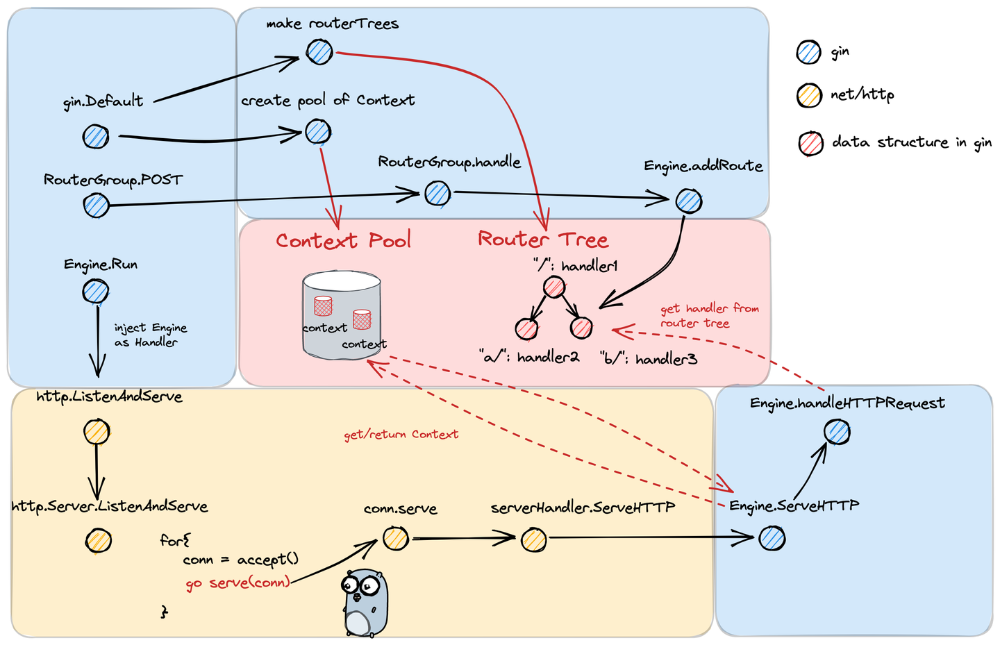
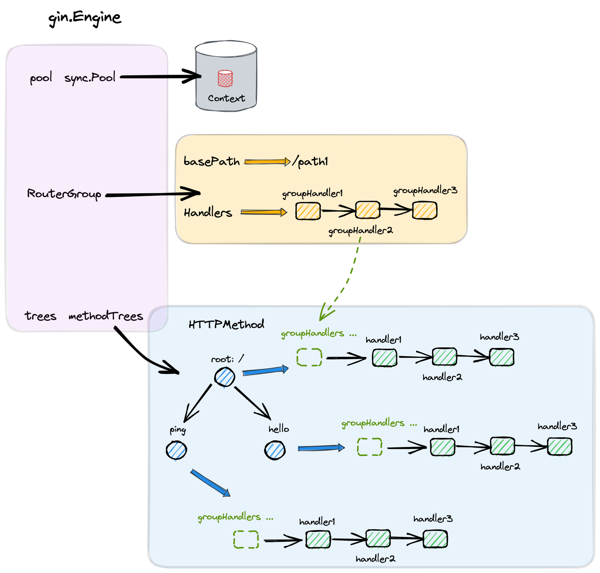
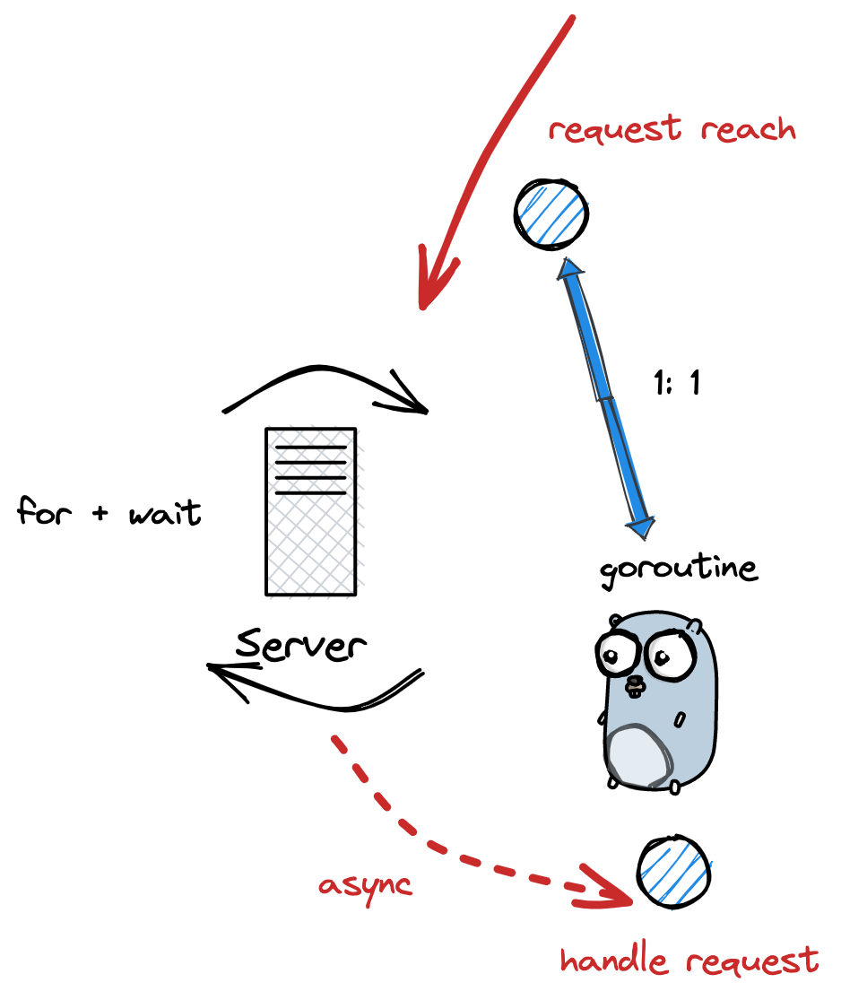
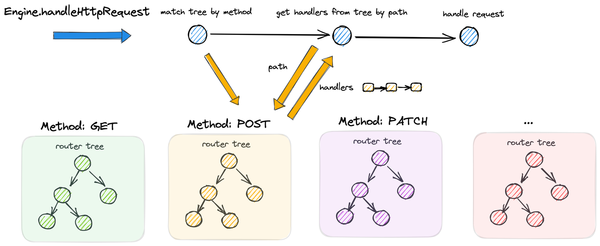
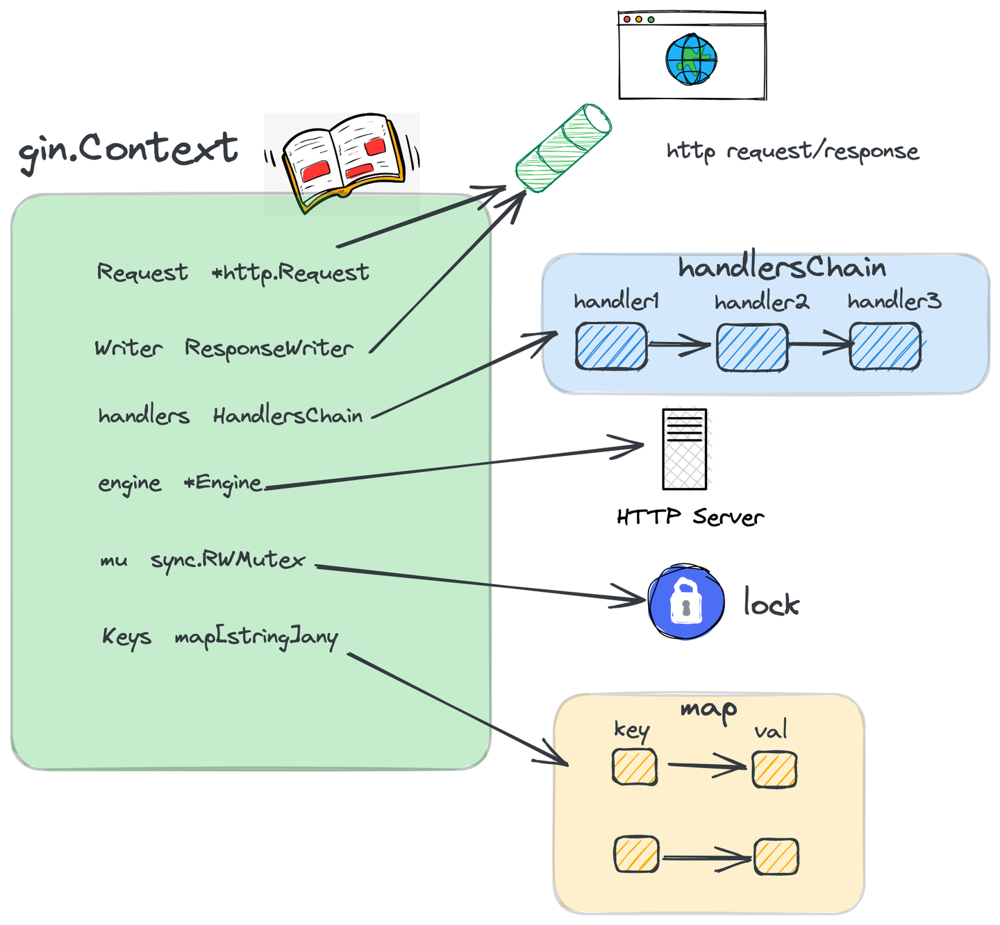
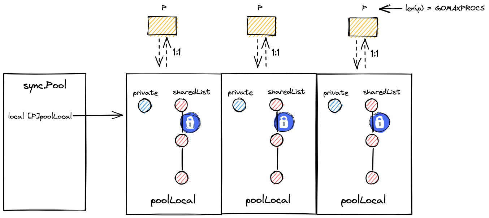
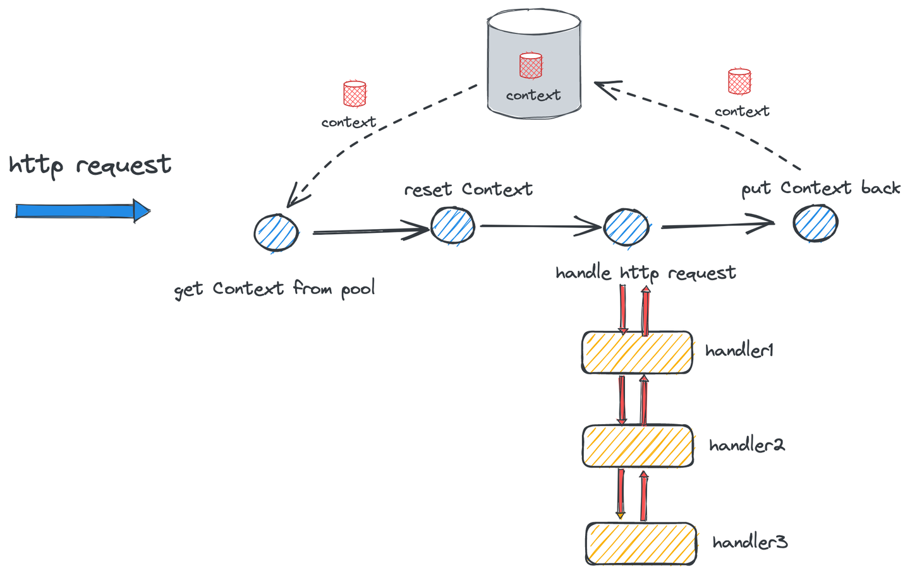
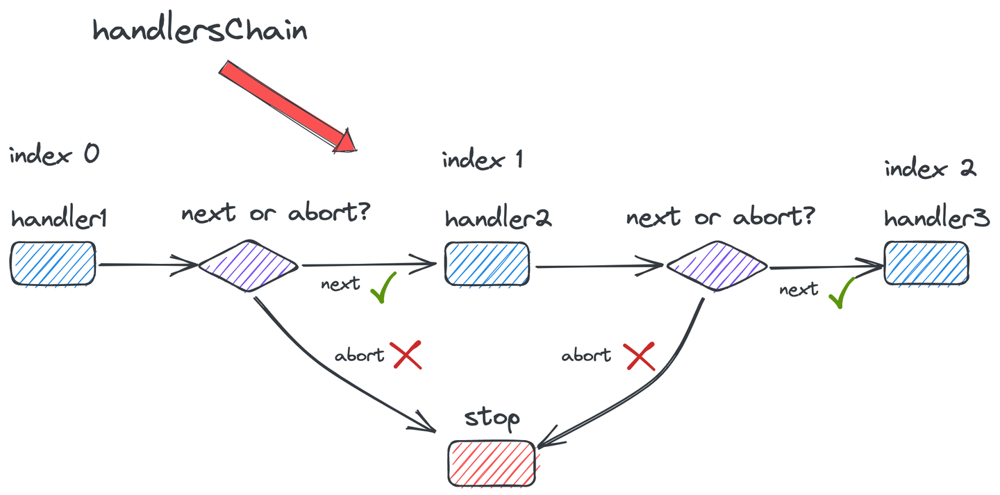
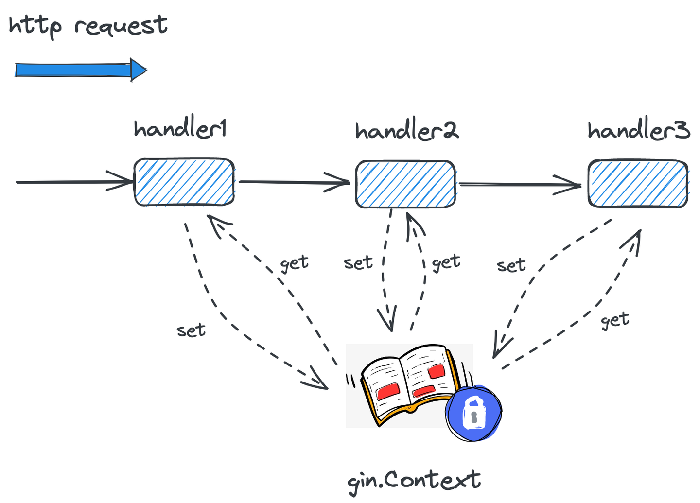

本文将深入分析 **Go Web 框架 Gin** 的底层实现原理，重点探究其核心机制和设计哲学。

## 1 Gin 与 HTTP

### 1.1 Gin 的背景

Gin 是 Go 语言生态中最流行的 Web 框架之一。

本文涉及的源码分析基于 **v1.11.0** 版本。

业界广泛采用 Gin 的原因主要包括其提供的核心能力：

- **中间件支持**：通过 **HandlersChain** 机制实现请求处理流水线化（中间件）。
- **上下文封装**：提供功能丰富且易用的 **gin.Context** 对象，简化请求处理。
- **高效路由**：采用 **Radix Tree (压缩前缀树)** 实现高性能的路由解析和匹配。

### 1.2 Gin 与 net/http 的关系

Gin 并非独立实现了 HTTP 服务器，而是在 Go 标准库 `net/http` 的基础上进行了**高级封装和功能增强**。两者的交互边界如下图所示：



在 `net/http` 既定的框架体系下，Gin 提供了一个 **`gin.Engine`** 结构体，其实现了 `net/http.Handler` 接口，因此可以作为 Go HTTP `Server` 的请求处理器（Handler）注入其 `Server` 中。`gin.Engine` 负责完成**路由注册、路由匹配和请求处理链的调度**。

### 1.3 Gin 框架使用示例

以下代码示例展示了 Gin 框架的基本使用模式：

- **创建实例**：通过 `gin.Default()` 创建 `gin.Engine` 实例。
- **注册中间件**：使用 `Engine.Use()` 在全局路由组注册中间件。
- **注册路由**：使用 `Engine.POST()` 等方法注册路由（特定 HTTP 方法和路径对应的处理 Handler）。
- **启动服务**：调用 `Engine.Run()` 启动底层的 HTTP 服务器。

```go
import "github.com/gin-gonic/gin"


func main() {
    // 创建一个 gin Engine，本质上是一个 http Handler
    r := gin.Default()
    // 注册中间件
    r.Use(myMiddleWare)
    // 注册一个 method 为 POST，path 为 /ping 的路由
    r.POST("/ping", func(c *gin.Context) {
        c.JSON(http.StatusOK, "pong")
    })
    // 运行 http 服务
    if err := r.Run(":8080"); err != nil {
        panic(err)
    }
}
```

## 2 路由注册 (Handler Registration) 流程

### 2.1 核心数据结构



首先，我们分析 Gin 实现路由和中间件机制所依赖的核心数据结构：

#### `gin.Engine`

`Engine` 是 Gin 框架的核心入口，它负责管理配置、路由树和上下文对象池。

```go
type Engine struct {
   // 路由组
    RouterGroup
    // ...
    // context 对象池
    pool             sync.Pool
    // 方法路由树
    trees            methodTrees
    // ...
}
```

由于 `Engine` 实现了 `net/http` 标准库中的 `Handler` 接口，它能够被注入到 Go 的 `http.Server` 中，作为处理所有传入 HTTP 请求的入口点。

```go
// net/http 包下的 Handler interface
type Handler interface {
    ServeHTTP(ResponseWriter, *Request)
}


func (engine *Engine) ServeHTTP(w http.ResponseWriter, req *http.Request) {
    // ...
}
```

`Engine` 的核心组成部分包括：

- **`RouterGroup` (路由组)**：用于组织和复用路由配置。
- **`pool` (Context 对象池)**：基于 `sync.Pool` 实现，用于复用 `gin.Context` 实例，从而减少垃圾回收 (GC) 压力。
- **`trees` (路由树数组)**：包含 9 棵基于**压缩前缀树**（Radix Tree）实现的路由树，每棵树对应一种标准的 HTTP 方法。

Gin 支持的 9 种 HTTP 方法常量如下：

```go
const (
    MethodGet     = "GET"
    MethodHead    = "HEAD"
    MethodPost    = "POST"
    MethodPut     = "PUT"
    MethodPatch   = "PATCH" // RFC 5789
    MethodDelete  = "DELETE"
    MethodConnect = "CONNECT"
    MethodOptions = "OPTIONS"
    MethodTrace   = "TRACE"
)
```

#### `RouterGroup`

`RouterGroup` 实现了路由组的概念，允许配置在其下注册的所有路由中复用。

```go
type RouterGroup struct {
    Handlers HandlersChain
    basePath string
    engine *Engine
    root bool
}
```

- **`Handlers`**：路由组的公共处理函数链（中间件）。在该组下注册的路由，其最终的处理函数链将是 `RouterGroup` 的 `Handlers` 加上该路由自己的处理函数。
- **`basePath`**：路由组的基础路径。路由的绝对路径由 `RouterGroup` 的 `basePath` 和其自身的相对路径拼接而成。
- **`engine`**：指向该路由组所属的 `Engine` 实例。
- **`root`**：指示该路由组是否是 `Engine` 的根路由组。通过 `RouterGroup.Group` 创建的子路由组，此标识为 `false`。

#### `HandlersChain`

`HandlersChain` 是由多个路由处理函数 `HandlerFunc` 构成的切片，代表了对一个请求的**完整处理流程**（包括所有中间件和最终处理逻辑）。在请求调用时，它们将按照切片索引顺序依次执行。

```go
type HandlersChain []HandlerFunc


type HandlerFunc func(*Context)
```

### 2.2 流程入口

我们沿着 `main` 函数中的调用顺序，解析 `gin.Engine` 的初始化、中间件注册和路由注册的源码实现：

```go
func main() {
    // 创建一个 gin Engine，本质上是一个 http Handler
    r := gin.Default()
    // 注册中间件
    r.Use(myMiddleWare)
    // 注册一个 path 为 /ping 的处理函数
    r.POST("/ping", func(c *gin.Context) {
        c.JSON(http.StatusOK, "pong")
    })
    // ...
}
```

### 2.3 初始化 Engine

`gin.Default` 方法最终会调用 `gin.New` 来完成 `Engine` 的初始化。

**方法调用链：** `gin.Default` $\to$ `gin.New`

初始化过程的关键步骤包括：

1. 创建 `gin.Engine` 实例。
2. 初始化 Engine 的**根路由组**：`Handlers` 为 `nil`，`basePath` 为 `"/"`，`root` 标志为 `true`。
3. 构造 9 棵空的**方法路由树**，对应 9 种 HTTP 方法。
4. 创建并配置 `gin.Context` 的**对象池**。

```go
func Default() *Engine {
    engine := New()
    // ...
    return engine
}
```

需要注意的是，`gin.Default()` 在调用 `gin.New()` 之后，会自动注册两个常用的全局中间件：`Logger`（用于请求日志记录）和 `Recovery`（用于从运行时 `panic` 中恢复），为开发和生产环境提供基础的监控和健壮性。

```go
func New() *Engine {
    // ...
    // 创建 gin Engine 实例
    engine := &Engine{
        // 路由组实例
        RouterGroup: RouterGroup{
            Handlers: nil,
            basePath: "/",
            root:     true,
        },
        // ...
        // 9 棵路由压缩前缀树，对应 9 种 HTTP 方法
        trees:                  make(methodTrees, 0, 9),
        // ...
    }
    engine.RouterGroup.engine = engine
    // gin.Context 对象池
    engine.pool.New = func() any {
        return engine.allocateContext(engine.maxParams)
    }
    return engine
}
```

### 2.4 注册 Middleware

通过 `Engine.Use` 方法注册的中间件，会被添加到**根路由组**的 `Handlers` 链中。此后，在该路由组下（包括全局）新注册的所有路由，都会将这些公共的中间件添加到其处理函数链的**最前端**。

```go
func (engine *Engine) Use(middleware ...HandlerFunc) IRoutes {
    engine.RouterGroup.Use(middleware...)
    // ...
    return engine
}
```

该操作直接修改了 `RouterGroup` 结构体中的 `Handlers` 字段。

```go
func (group *RouterGroup) Use(middleware ...HandlerFunc) IRoutes {
    group.Handlers = append(group.Handlers, middleware...)
    return group.returnObj()
}
```

### 2.5 注册 Handler


以注册 HTTP POST 方法为例，方法调用顺序为 `RouterGroup.POST` $\to$ `RouterGroup.handle`。该过程将完成以下三个关键步骤：

1. **拼接路径**：计算出待注册路由的**完整绝对路径** (`absolutePath`)，它由路由组的 `basePath` 和相对路径拼接而成。
2. **拼接处理函数链**：将路由组的中间件 (`group.Handlers`) 和路由自身的处理函数 (`handlers`) 拼接，组成完整的请求处理链。
3. **注册到路由树**：将 `absolutePath` 和完整的 `handlers` 链作为一个键值对，添加到对应 HTTP 方法的路由树中。

```go
func joinPaths(absolutePath, relativePath string) string {
    if relativePath == "" {
        return absolutePath
    }


    finalPath := path.Join(absolutePath, relativePath)
    if lastChar(relativePath) == '/' && lastChar(finalPath) != '/' {
        return finalPath + "/"
    }
    return finalPath
}
```

#### 注册 Handler 到路由树

路由注册的核心逻辑位于 `Engine.addRoute` 方法中：

1. 根据 HTTP method **获取**或**创建**对应的 `methodTree` 根节点 (`root`)。
2. 调用 `root.addRoute(path, handlers)` 将路径和处理函数链注册到 Radix Tree 中。

路由树的 `addRoute` 逻辑细节复杂，涉及节点的插入、分裂和优先级调整，详见本文第 4 章。

```go
func (engine *Engine) addRoute(method, path string, handlers HandlersChain) {
    // ...
    root := engine.trees.get(method)
    if root == nil {
        root = new(node)
        root.fullPath = "/"
        engine.trees = append(engine.trees, methodTree{method: method, root: root})
    }
    root.addRoute(path, handlers)
    // ...
}
```

## 3 服务启动与请求处理流程

### 3.1 流程入口

本节将以 `Engine.Run` 启动服务和处理请求为主线进行源码解析。

```go
func main() {
    // 创建一个 gin Engine，本质上是一个 HTTP Handler
    r := gin.Default()

    // 一键启动 HTTP 服务
    if err := r.Run(); err != nil {
        panic(err)
    }
}
```

### 3.2 启动服务

调用 `Engine.Run` 方法，实际上是将 `gin.Engine` 实例作为 `net/http.Handler` 的实现，然后调用 Go 标准库的 `http.ListenAndServe` 函数来启动底层的 HTTP 服务。

```go
func (engine *Engine) Run(addr ...string) (err error) {
    // ...
    err = http.ListenAndServe(address, engine.Handler())
    return
}
```

`http.ListenAndServe` 内部会创建一个 `http.Server`，该服务器基于**网络轮询**和 **I/O 多路复用**（如 epoll 或 kqueue）机制运行。程序在正常运行期间会阻塞在 `http.ListenAndServe` 调用中，持续监听和接受新的连接。



标准库中 `http.Server.Serve` 的核心逻辑展示了连接的接受和处理：

```go
func (srv *Server) Serve(l net.Listener) error {
   // ...
   ctx := context.WithValue(baseCtx, ServerContextKey, srv)
    for {
        rw, err := l.Accept()
        // ...
        connCtx := ctx
        // ...
        c := srv.newConn(rw)
        // ...
        go c.serve(connCtx)
    }
}
```

### 3.3 处理请求 (ServeHTTP)

当服务端接收到新的 HTTP 请求时，`net/http` 框架会调用注入的 `Handler.ServeHTTP` 方法，即 `gin.Engine.ServeHTTP`。

`Engine` 处理请求的核心步骤如下：

1. **获取 Context**：从 `Engine` 的对象池中获取一个可复用的 `gin.Context` 实例。
2. **初始化 Context**：重置 `Context` 的内部状态，将新的 `http.ResponseWriter` 和 `http.Request` 引用注入。
3. **处理请求**：调用 `Engine.handleHTTPRequest` 方法进行核心业务逻辑处理。
4. **回收 Context**：请求处理完成后，将 `gin.Context` 实例放回对象池 (`engine.pool.Put(c)`)，供后续请求复用。

```go
func (engine *Engine) ServeHTTP(w http.ResponseWriter, req *http.Request) {
    // 从对象池中获取一个 context
    c := engine.pool.Get().(*Context)

    // 重置/初始化 context
    c.writermem.reset(w)
    c.Request = req
    c.reset()

    // 处理 http 请求
    engine.handleHTTPRequest(c)


    // 把 context 放回对象池
    engine.pool.Put(c)
}
```


`Engine.handleHTTPRequest` 方法的核心逻辑在于**路由查找**和**处理链启动**：

1. **获取方法树**：根据 HTTP 方法 (`c.Request.Method`) 从 `engine.trees` 中找到对应的 Radix Tree。
2. **路由查找**：使用请求路径 (`c.Request.URL.Path`) 调用 `root.getValue` 方法在路由树中查找匹配的路由和对应的处理函数链 (`value.handlers`)。
3. **启动处理链**：将查找到的 `handlers` 注入到 `gin.Context` 中，并通过调用 `c.Next()` 方法启动整个请求处理链的遍历调用。

路由查找 (`root.getValue`) 逻辑详见第 4 章；`gin.Context.Next` 遍历处理函数链的机制详见第 5 章。

```go
func (engine *Engine) handleHTTPRequest(c *Context) {
    httpMethod := c.Request.Method
    rPath := c.Request.URL.Path

    // ...
    t := engine.trees
    for i, tl := 0, len(t); i < tl; i++ {
        // 获取对应的方法树
        if t[i].method != httpMethod {
            continue
        }
        root := t[i].root
        // 从路由树中寻找路由
        value := root.getValue(rPath, c.params, c.skippedNodes, unescape)
        if value.params != nil {
            c.Params = *value.params
        }
        if value.handlers != nil {
            c.handlers = value.handlers
            c.fullPath = value.fullPath
            c.Next()
            c.writermem.WriteHeaderNow()
            return
        }
        // ...
        break
    }
    // ...
}
```

## 4 Gin 的路由树 (Radix Tree)

### 4.1 策略与原理

在分析 Gin 路由树的实现前，需要理解其基于的**压缩前缀树**（Radix Tree，也称基数树）数据结构。

#### 前缀树 (Trie)

前缀树是一种通过利用字符串的**公共前缀**来存储字符串的树形数据结构。其基本特征包括：

- 除了根节点，每个节点代表一个字符。
- 从根节点到任意节点的路径上的字符序列，构成了该节点所代表的字符串。
- 它通过共享公共前缀的路径，有效地索引字符串。

#### 压缩前缀树 (Radix Tree)

压缩前缀树是标准前缀树的一种**空间优化**变种。其核心优化策略是：如果一个节点是其父节点的**唯一子节点**，则该节点会与父节点合并，将中间的路径压缩到一个节点中。

Gin 框架正是利用这种压缩前缀树来实现高效且功能强大的路由匹配。

#### 选择压缩前缀树的原因

相比使用简单的 Hash Map（例如 `map[string]HandlersChain`）来映射路径到处理函数，Gin 选择树形结构的原因包括：

- **支持模糊匹配和参数提取**：路由匹配并非总是精确匹配，它需要处理路径参数（如 `:id`）和通配符（如 `/*filepath`）。树形结构天然支持这种路径匹配逻辑，而 Hash Map 难以高效实现。
- **性能考量**：对于路由数量相对有限的应用场景，Hash Map 的性能优势并不明显，在小到中等数据量下，Radix Tree 在特定操作中可能表现更优。
- **空间效率**：Web 路由路径通常具有基于分组的公共前缀（例如 `/api/v1/users` 和 `/api/v1/products`），Radix Tree 通过复用这些公共前缀，可以节省存储空间。

#### 优先级补偿策略

在 Gin 路由树的构建中，使用了**优先级补偿策略**：在节点的 `children` 数组中，处理函数（`handlers`）注册较多的子节点会被安排在数组的**更靠前**的位置。

这种策略基于以下考量：如果某条路径注册了更多的处理函数（意味着它代表了更多的处理逻辑或中间件），则认为它被匹配命中的概率更高，或者处理成本更高。因此，应该被优先检索和处理，以优化整体的路由匹配效率。


### 4.2 核心数据结构

路由树由 `methodTree` 和 `node` 两个核心结构体组成。

- **`methodTree`**：对应一种 HTTP 方法，通过 `root` 指针指向该方法的 Radix Tree 根节点。

```go
type methodTree struct {
    method string
    root   *node
}
```

- **`node`**：Radix Tree 中的基本节点单元。

```go
type node struct {
    // 节点的相对路径片段
    path string
    // 每个 indice 字符对应一个孩子节点的 path 首字母，用于快速查找
    indices string
    // ...
    // 路由数量：途径本节点的路由数量，用于决定在父节点中的检索优先级
    priority uint32
    // 孩子节点列表
    children []*node
    // 当前节点对应的处理函数链（仅在完整路径节点上非空）
    handlers HandlersChain
    // path 拼接上前缀后的完整路径
    fullPath string
}
```

### 4.3 注册到路由树

下面详细解析路径和处理函数链 (`path` + `handlers`) 被插入到 Radix Tree (`node.addRoute`) 的过程。

```go
// 插入新路由
func (n *node) addRoute(path string, handlers HandlersChain) {
    fullPath := path
    // 每有一个新路由经过此节点，priority 都要加 1
    n.priority++


    // 若当前节点为根节点 (root) 且未注册过任何子节点，则直接插入并返回
    if len(n.path) == 0 && len(n.children) == 0 {
        n.insertChild(path, fullPath, handlers)
        n.nType = root
        return
    }


// 外层 for 循环断点
walk:
    for {
        // 1. 计算当前节点路径 n.path 和待插入路由 path 的最长公共前缀长度 i
        i := longestCommonPrefix(path, n.path)

        // 2. 节点分裂 (Splitting)
        // 倘若最长公共前缀长度 i 小于 n.path 的长度，代表当前节点 n 需要分裂
        // 例如：n.path = "search"，待插入 path = "see"
        // 最长公共前缀长度 i = 2 ("se")，len(n.path) = 6
        if i < len(n.path) {
        // 2a. 创建新的子节点 child，承载原节点 n 的后半部分路径 (例如 "arch")
            child := node{
                path:      n.path[i:],
                // 原本 n 的所有参数和子节点都转移给 child
                indices:   n.indices,
                children: n.children,
                handlers:  n.handlers,
                // 原节点 n 的 priority 被加 1 了，现在需要将其还原并赋给 child
                priority:  n.priority - 1,
                fullPath:  n.fullPath,
            }


            // 2b. 调整原节点 n 成为公共前缀节点 (例如 "se")
            n.children = []*node{&child}
            // 设置新 children 的索引
            n.indices = bytesconv.BytesToString([]byte{n.path[i]})
            n.path = path[:i]
            // n 变为中间节点，handlers 设为 nil (处理函数托付给 child)
            n.handlers = nil
            // ...
        }


        // 3. 寻找或创建子节点
        // 最长公共前缀长度 i 小于 path 的长度，表示还有剩余路径需要插入
        if i < len(path) {
            // path 截断公共前缀，剩余部分 (例如 "e")
            path = path[i:]
            c := path[0] // 剩余路径的首字符

            // 3a. 遍历 n 的 indices，检查是否存在与 path 剩余部分首字母匹配的子节点
            for i, max := 0, len(n.indices); i < max; i++ {
               // 找到首字母匹配的 child node
                if c == n.indices[i] {
                    // 找到了，则增加该 child 的 priority，然后将 n 指向 child
                    i = n.incrementChildPrio(i)
                    n = n.children[i]
                    // 跳转到外层 for 循环 walk，开始新一轮处理
                    continue walk
                }
            }

            // 3b. 若不存在匹配的子节点，则将 path 剩余部分包装成一个新 child node 进行插入
            // n 的 indices 新增 path 的首字母
            n.indices += bytesconv.BytesToString([]byte{c})
            // 创建新的 child node
            child := &node{
                fullPath: fullPath,
            }
            // 新 child node append 到 n.children 数组中
            n.addChild(child)
            // 增加新 child 的 priority 并调整其在 children 数组中的位置
            n.incrementChildPrio(len(n.indices) - 1)
            // 将 n 指向新插入的 child
            n = child
            // 将 path 剩余部分和 handlers 赋值给新 child
            n.insertChild(path, fullPath, handlers)
            return
        }


        // 4. 路径完全匹配
        // 此处的分支是，path 恰好等于或被 n.path 完整匹配 (例如 "se" 之于 "search")
        // 如果该节点已存在 handlers，说明路由重复注册，引发 panic
        if n.handlers != nil {
            panic("handlers are already registered for path '" + fullPath + "'")
        }
        // 为当前节点设置 handlers
        n.handlers = handlers
        // ...
        return
}
```

辅助方法 `insertChild` 仅用于为节点赋值：

```go
func (n *node) insertChild(path string, fullPath string, handlers HandlersChain) {
    // ...
    n.path = path
    n.handlers = handlers
    // ...
}
```

在 4.1 小节第（4）部分提到的**优先级补偿策略**，在 `incrementChildPrio` 方法中实现：它在增加子节点 `priority` 后，会**调整**该子节点在 `children` 数组中的位置，确保 `priority` 更高的子节点位于数组的前列，从而被优先检索。

```go
func (n *node) incrementChildPrio(pos int) int {
    cs := n.children
    cs[pos].priority++
    prio := cs[pos].priority


    // Adjust position (move to front)
    newPos := pos
    // 循环向前移动，直到找到一个 priority 大于或等于自己的节点位置
    for ; newPos > 0 && cs[newPos-1].priority < prio; newPos-- {
        // Swap node positions
        cs[newPos-1], cs[newPos] = cs[newPos], cs[newPos-1]
    }


    // Build new index char string
    if newPos != pos {
        // 重新构建 indices 字符串以匹配 children 数组的新顺序
        n.indices = n.indices[:newPos] + // Unchanged prefix, might be empty
            n.indices[pos:pos+1] + // The index char we move
            n.indices[newPos:pos] + n.indices[pos+1:] // Rest without char at 'pos'
    }


    return newPos
}
```

### 4.4 检索路由树

路由检索方法 `node.getValue` 对应于本文 3.3 小节中，根据请求路径 (`path`) 从路由树中查找对应 `handlers` 的过程。

```go
type nodeValue struct {
    // 处理函数链
    handlers HandlersChain
    // ...
}
```

```go
// 从路由树中获取 path 对应的 handlers
func (n *node) getValue(path string, params *Params, skippedNodes *[]skippedNode, unescape bool) (value nodeValue) {
    var globalParamsCount int16


// 外层 for 循环断点
walk:
    for {
        prefix := n.path
        // 1. 检查当前节点的路径前缀匹配
        // 待匹配 path 长度大于当前节点 path 长度
        if len(path) > len(prefix) {
            // path 以 node.path 为前缀
            if path[:len(prefix)] == prefix {
                // path 截去已匹配的前缀部分
                path = path[len(prefix):]
                // 找到 path 剩余部分的首字符
                idxc := path[0]
                // 2. 遍历当前 node 的 indices，寻找可能的子节点
                for i, c := range []byte(n.indices) {
                    // 找到了首字母匹配的 child node
                    if c == idxc {
                        // 将 n 指向 child node，调到 walk 断点开始下一轮处理
                        n = n.children[i]
                        continue walk
                    }
                }


                // ... (处理参数和通配符匹配逻辑)
            }
        }


        // 3. 路径完全匹配
        // 倘若 path 剩余部分正好等于 node.path，说明已经找到目标路由
        if path == prefix {
            // ...
            // 取出对应的 handlers 进行返回
            if value.handlers = n.handlers; value.handlers != nil {
                value.fullPath = n.fullPath
                return
            }


            // ... (处理尾部斜杠 / 匹配等)
        }


        // 4. 匹配失败
        // 倘若 path 与 node.path 已经没有公共前缀，说明匹配失败，此处不展开
        // ...
 }
```

## 5 Gin.Context

### 5.1 核心数据结构



`gin.Context` 对象的定位是对应于**单次 HTTP 请求**，并在整个 `HandlersChain` 调用链中**贯穿和传递**的请求上下文数据结构。它封装了请求/响应对象，并提供了数据共享、流程控制等核心功能。

`Context` 包含的核心字段包括：

- **`Request` / `Writer`**：对底层 `http.Request` 和 `http.ResponseWriter` 的封装引用，作为读写 HTTP 请求和响应的接口。
- **`handlers`**：本次 HTTP 请求对应的完整处理函数链（中间件和路由处理函数）。
- **`index`**：当前处理进度，即处理链中**下一个**待调用的 `HandlerFunc` 的索引位置。
- **`engine`**：指向所属的 `Engine` 实例的指针。
- **`mu`**：用于保护 `Keys` Map 并发安全的读写互斥锁 (`sync.RWMutex`)。
- **`Keys`**：一个 `map[string]any`，用于在 `handlers` 链上的不同处理函数之间共享数据。

```go
type Context struct {
    // ...
    // http 请求参数
    Request   *http.Request
    // http 响应 writer
    Writer    ResponseWriter
    // ...
    // 处理函数链
    handlers HandlersChain
    // 当前处于处理函数链的索引，指向下一个待执行的 handler
    index    int8
    engine       *Engine
    // ...
    // 读写锁，保证并发安全
    mu sync.RWMutex
    // key value 对存储 map，用于数据共享
    Keys map[string]any
    // ..
}
```

### 5.2 复用策略 (sync.Pool)



由于 `gin.Context` 是处理每个 HTTP 请求的通用数据结构，它会被频繁地创建和销毁。为了**降低 Go 垃圾回收 (GC) 系统的压力**，Gin 采用了 **`sync.Pool` 对象池**机制进行 `Context` 实例的缓存复用。

**工作流程：**

1. **请求到达**：从 `engine.pool` 中获取 `Context` 实例。如果池中没有可用实例，则通过 `pool.New` 方法构造一个新的 `Context`。
2. **请求处理**：`Context` 实例在处理链中被使用。
3. **处理完成**：请求处理结束后，该 `Context` 实例被调用 `Put` 方法放回 `pool` 中，等待后续复用。

`sync.Pool` 旨在作为**临时对象**的回收站。放入其中的对象在逻辑上已被删除，但在物理内存上仍保留，可存活至多两个 GC 周期。在此期间，它们可以被快速获取和复用，从而有效缓解高并发场景下的 GC 负担。

```go
type Engine struct {
    // context 对象池
    pool             sync.Pool
}
```

初始化 `Engine` 时配置了 `Context` 对象的构造函数：

```go
func New() *Engine {
    // ...
    engine.pool.New = func() any {
        return engine.allocateContext(engine.maxParams)
    }
    return engine
}
```

```go
func (engine *Engine) allocateContext(maxParams uint16) *Context {
    v := make(Params, 0, maxParams)
   // ...
    return &Context{engine: engine, params: &v, skippedNodes: &skippedNodes}
}
```

### 5.3 分配与回收时机



`gin.Context` 的获取和回收时机严格位于 `gin.Engine.ServeHTTP` 方法的开始和结束，确保了 Context 实例的生命周期与单次 HTTP 请求的处理周期完全同步。

```go
func (engine *Engine) ServeHTTP(w http.ResponseWriter, req *http.Request) {
    // 从对象池中获取一个 context (分配/获取时机)
    c := engine.pool.Get().(*Context)
    // 重置/初始化 context
    c.writermem.reset(w)
    c.Request = req
    c.reset()
    // 处理 http 请求
    engine.handleHTTPRequest(c)

    // 把 context 放回对象池 (回收时机)
    engine.pool.Put(c)
}
```

### 5.4 使用时机

#### HandlersChain 入口

在 `Engine.handleHTTPRequest` 方法中，当路由查找成功后，获取到的 `handlers` 链会被注入到 `Context.handlers` 字段中，然后通过调用 `Context.Next()` 方法，正式启动中间件和处理函数的执行流程。

```go
func (engine *Engine) handleHTTPRequest(c *Context) {
    // ...
    // ... (路由查找逻辑)
        if value.handlers != nil {
            c.handlers = value.handlers
            c.fullPath = value.fullPath
            c.Next() // 启动处理函数链的遍历调用
            c.writermem.WriteHeaderNow()
            return
        }
    // ...
}
```

#### HandlersChain 遍历调用



推进 `handlers` 链执行进度的核心方法是 `Context.Next()`。它通过递增 `Context.index` 作为索引，然后在一个 `for` 循环中依次调用 `handlers` 链中的处理函数。

```go
func (c *Context) Next() {
    c.index++
    for c.index < int8(len(c.handlers)) {
        c.handlers[c.index](c)
        c.index++
    }
}
```

由于 `Context` 实例在整个调用链路中是可访问的，用户可以在**任何** `HandlerFunc` 中通过手动调用 `Context.Next()` 来**显式地**将控制权传递给下一个处理函数。

这种机制利用了**方法调用栈**的特性：当后续所有 `handlers` 处理完成后，控制权最终会返回到调用 `Context.Next()` 的位置，允许原先的 `handler` 执行其**剩余部分**（即后处理逻辑）。


结合代码示例，一个典型的中间件/处理函数可以在 `Context.Next` 调用前后声明前处理逻辑和后处理逻辑：

```go
func myHandleFunc(c *gin.Context){
    // 前处理逻辑 (相对于后续所有 handlers 而言)
    preHandle()
    c.Next() // 将控制权交给下一个 handler
    // 后处理逻辑 (在后续所有 handlers 执行完成后返回此处执行)
    postHandle()
}
```

**熔断机制 (Context.Abort)**

用户可以在任何 `handler` 中通过调用 `Context.Abort()` 方法实现 `handlers` 链路的**提前终止**（熔断）。

其实现原理是将 `Context.index` 设置为一个固定的越界值 `abortIndex` (63)。当 `Context.Next` 循环判断 `c.index < int8(len(c.handlers))` 时，由于 `abortIndex` 被设计为大于任何可能的 `HandlersChain` 长度，循环会立即终止，从而阻止后续 `handlers` 的执行。

```go
const abortIndex int8 = 63


func (c *Context) Abort() {
    c.index = abortIndex
}
```

同时，用户可以通过 `Context.IsAborted` 方法检测处理链是否已被中止：

```go
func (c *Context) IsAborted() bool {
    return c.index >= abortIndex
}
```

**HandlersChain 长度限制**：为了确保熔断机制可靠，Gin 强制要求 `handlers` 链的总长度必须小于 `abortIndex`（63）。如果尝试注册长度超过 63 的处理函数链，则会触发 `panic`。

```go
func (group *RouterGroup) combineHandlers(handlers HandlersChain) HandlersChain {
    finalSize := len(group.Handlers) + len(handlers)
    // 断言 handlers 链长度必须小于 63
    assert1(finalSize < int(abortIndex), "too many handlers")
    // ...
}
```

#### 共享数据存取



作为 `handlers` 链的上下文，`gin.Context` 提供了 `Get` 和 `Set` 接口供用户在不同处理函数（Handler）间安全地存取共享数据。

```go
type Context struct {
    // ...
    // 读写锁，保证并发安全
    mu sync.RWMutex


    // key value 对存储 map
    Keys map[string]any
}
```

所有对 `Context.Keys` 的操作都受到**读写锁** (`sync.RWMutex`) 的保护，确保在高并发环境下数据访问的**线程安全性**。

读取共享数据 (`Get`) 使用读锁 (`RLock`)：

```go
func (c *Context) Get(key string) (value any, exists bool) {
    c.mu.RLock()
    defer c.mu.RUnlock()
    value, exists = c.Keys[key]
    return
}
```

写入共享数据 (`Set`) 使用写锁 (`Lock`)：

```go
func (c *Context) Set(key string, value any) {
    c.mu.Lock()
    defer c.mu.Unlock()
    if c.Keys == nil {
        c.Keys = make(map[string]any)
    }


    c.Keys[key] = value
}
```

## 6 总结

本文对 Gin 框架的底层原理进行了深入的分析：

- **集成标准库**：Gin 通过让 `Engine` 实现 `http.Handler` 接口，无缝融入 Go 的 `net/http` 标准库框架体系。
- **中间件机制**：通过 `HandlersChain` 实现中间件和最终处理函数的管道化和协调调用。
- **高效路由**：路由匹配基于**压缩前缀树**（Radix Tree）数据结构实现，为每种 HTTP 方法维护一棵独立的路由树，提供高效的模糊匹配能力。
- **上下文核心**：`gin.Context` 是贯穿整个请求处理链的核心数据结构，用于封装请求/响应、管理处理进度和共享数据。
- **性能优化**：`gin.Context` 是通过 `sync.Pool` **对象池**进行缓存复用的资源对象，有效减轻了高并发下的 Go 垃圾回收压力。
