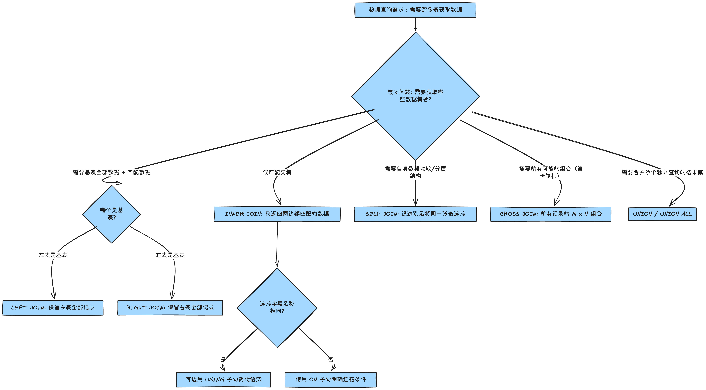

## SQL 查询性能优化：从零掌握 12 种 JOIN 联表查询的架构与实战

### 1. 简介

本文系统性解析了 SQL 中所有核心的联表和集合操作，包括 INNER/OUTER/SELF/CROSS JOIN、USING 子句以及 UNION，旨在帮助读者构建高效且准确的复杂数据查询能力。

### 2. 背景与问题定义

**本文解决的**具体业务或技术问题：

关系型数据库设计遵循**范式理论**（Normalization），目的是减少数据冗余、确保数据一致性。这导致一个完整的业务实体（例如「订单」）通常被拆分到多个逻辑相关的表中（例如 `orders`、`customers`、`order_statuses`）。

**传统方案的局限性**：

如果只使用单一表查询，我们无法获取完整的业务视图。例如，仅查询 `orders` 表，我们只能得到 `customer_id` 和 `status` 的数字 ID，但不知道客户的姓名或订单状态的具体描述。这使得数据分析和业务决策变得困难且低效。

**为什么需要当前方案？真实场景是什么？**

我们需要一种机制，能够基于列之间的关系（通常是主键/外键）将分散的数据准确地**连接 (JOIN)** 起来。

**真实场景示例：** 

**订单详情查询**：我们不仅需要订单的基本信息（`orders` 表），还需要客户的联系信息（`customers` 表）、订单的当前状态（`order_statuses` 表）以及处理订单的物流方信息（`shippers` 表）。复杂的业务报表和数据分析是联表查询最核心的应用场景。

### 3. 整体架构 / 逻辑流程

联表查询的本质，是确定多个表之间数据的**交集、并集或全组合**。选择正确的 JOIN 类型是实现高效查询的第一步。

以下 Mermaid 图展示了在面对多表查询需求时，如何根据业务需求选择合适的联表查询类型：



**高层设计决策和关键路径：**

1. **数据准确性优先 (INNER JOIN)**：当业务要求结果集中的每一行都必须在所有关联表中存在有效记录时，使用 `INNER JOIN`。
2. **数据完整性优先 (OUTER JOIN)**：当业务要求即使某些关联数据缺失，基表的数据也必须完整呈现时（例如，查询所有客户，即使有些客户从未下过订单），使用 `LEFT JOIN` 或 `RIGHT JOIN`。在实践中，推荐优先使用可读性更高的 **`LEFT JOIN`**，并通过调整表顺序实现相同的效果。

### 4. 核心实现（按功能/概念模块组织）

#### 4.1 基础连接：INNER JOIN (内连接)

`INNER JOIN` 是最常用的连接类型，它只返回两个表中连接字段相匹配的行（即两个表的交集）。

**模块标题**：基础交集查询与表别名

```sql
-- 核心功能：查询订单与其对应的客户信息
-- 查询结果只包含在两张表中均可以匹配到的 customer_id 的结果，匹配不到的都不会返回
SELECT *
FROM orders
  JOIN customers ON orders.customer_id = customers.customer_id;


-- 优化可读性：使用表别名和精确字段选择
SELECT
  o.customer_id, -- 订单表的客户ID
  c.first_name, -- 客户表的名
  c.last_name -- 客户表的姓
FROM orders o -- orders 使用别名 o
  JOIN customers c -- customers 使用别名 c
  ON o.customer_id = c.customer_id; -- 明确连接条件
```

**实现要点**：使用表别名（如 `o` 和 `c`）是最佳实践，能缩短查询语句，并避免多表字段同名时的歧义。

#### 4.2 跨数据库与多表连接

复杂业务通常涉及跨数据库、跨三张及以上表的连接，例如查询订单详情需要同时关联客户和订单状态。

**模块标题**：跨库查询与多表级联连接

```sql
USE sql_store;

-- 跨数据库查询：将当前 sql_store 库的 order_items 
-- 与 sql_inventory 库的 products 表连接
SELECT
  oi.order_id,
  oi.product_id,
  p.name,
  oi.quantity,
  oi.unit_price
FROM order_items oi
  JOIN sql_inventory.products p ON oi.product_id = p.product_id;


-- 多表级联连接：查询订单ID、日期、客户姓名和订单状态名称
SELECT
  o.order_id,
  o.order_date,
  c.first_name,
  c.last_name,
  os.name AS state -- 从 order_statuses 表获取状态描述
FROM orders o
JOIN customers c -- 连接客户表
  ON o.customer_id = c.customer_id
JOIN order_statuses os -- 连接订单状态表
  ON o.status = os.order_status_id;
```

**实现要点**：通过连续使用 `JOIN` 关键字，将多个表串联起来。每次 `JOIN` 后都必须紧随其独立的 `ON` 条件。跨数据库查询需使用 `database_name.table_name` 格式。

#### 4.3 自我连接 (SELF JOIN) 与复合连接 (COMPOUND JOIN)

`SELF JOIN` 用于在单个表内，基于某个关系（如员工 - 经理）进行查询。`COMPOUND JOIN` 用于连接条件需要组合多个字段才能唯一确定记录的情况。

**模块标题**：表内层级关系与多字段连接条件

```sql
USE sql_hr;

-- SELF JOIN 示例：查询员工及其汇报上级 (经理)
SELECT
  e.employee_id,
  e.first_name AS employee, -- 员工姓名
  m.first_name AS manager -- 经理姓名 (别名m代表同一张表)
FROM employees e -- 将 employees 表视为员工
  JOIN employees m -- 将 employees 表视为经理
  ON e.reports_to = m.employee_id; -- 通过员工的 reports_to 字段连接到经理的 employee_id


USE sql_store;

-- 复合连接条件示例：订单商品与订单商品备注的连接
-- order_items 表中 order_id 和 product_id 共同确定一条记录（复合主键）
SELECT *
FROM order_items oi
JOIN order_item_notes oin
  ON oi.order_id = oin.order_Id 
  AND oi.product_id = oin.product_id; -- 两个字段都必须匹配
```

**实现要点**：`SELF JOIN` 的关键在于为同一张表设置不同的别名。复合连接条件的关键字是 `AND`，确保所有连接字段都满足匹配。

#### 4.4 外连接：LEFT JOIN, RIGHT JOIN

外部连接用于确保基表（左表或右表）的所有记录都包含在结果集中，即使它们在另一张表中没有匹配项。

**模块标题**：数据完整性保障：外部连接的使用与选择

```sql
USE sql_store;

-- INNER JOIN (交集) 结果：只返回有订单的客户
SELECT
  c.customer_id,
  c.first_name,
  o.order_id
FROM customers c
JOIN orders o
  ON c.customer_id = o.customer_id;

-- LEFT JOIN (左外连接) 结果：保留左表 (customers) 所有数据
-- 即使客户没有订单 (o.order_id 将为 NULL)
SELECT
  c.customer_id,
  c.first_name,
  o.order_id
FROM customers c
LEFT JOIN orders o -- 以 customers 表为基准
  ON c.customer_id = o.customer_id
ORDER BY c.customer_id;

-- RIGHT JOIN (右外连接) 结果：保留右表 (orders) 所有数据
-- 即使订单的客户信息有问题 (c.first_name 可能为 NULL)
SELECT
  c.customer_id,
  c.first_name,
  o.order_id
FROM customers c
RIGHT JOIN orders o -- 以 orders 表为基准
  ON c.customer_id = o.customer_id
ORDER BY c.customer_id;
```

**实现要点**：`LEFT JOIN` 和 `RIGHT JOIN` 可以互相转换，最佳实践是尽量使用 **`LEFT JOIN`** 并将你希望保留全部记录的表放在 `FROM` 语句后。

#### 4.5 简化连接：USING 子句与隐式连接

当两个表中用于连接的字段名称完全相同时，可以使用 `USING` 子句来替代 `ON` 子句，简化语法。

**模块标题**：简化连接语法与可读性优化

```sql
USE sql_store;

-- 使用 USING 子句进行 INNER JOIN (连接字段名相同：customer_id)
SELECT
  o.order_id,
    c.first_name
FROM orders o
JOIN customers c
  USING (customer_id); -- 简洁且清晰

-- 复合连接的 USING 语法
SELECT
  oi.order_Id,
    oi.product_id,
    oin.note
FROM order_items oi
LEFT JOIN order_item_notes oin
  USING (order_id, product_id); -- 适用于复合主键连接

-- 隐式连接语法 (不推荐使用)
SELECT *
FROM orders o, customers c -- 用逗号分隔表名
WHERE o.customer_id = c.customer_id; -- 在 WHERE 子句中定义连接条件
```

**实现要点**：**推荐使用 `USING` 简化连接条件**，这比 `ON` 子句更简洁。**强烈不推荐使用隐式连接**，因为它将连接逻辑和筛选逻辑混淆，易造成错误（如遗漏 `WHERE` 导致笛卡尔积）。

#### 4.6 特殊连接：CROSS JOIN 与集合操作 UNION

`CROSS JOIN` (笛卡尔积) 产生第一个表中所有行与第二个表中所有行的所有可能组合。`UNION` 用于合并多个独立查询的结果集。

**模块标题**：全组合与结果集合并

```sql
USE sql_store;

-- CROSS JOIN 示例：获取所有客户与所有产品的全组合
-- 假设有 C 个客户，P 个产品，结果集有 C * P 条记录
SELECT
  c.first_name AS customer,
    p.name AS product
FROM customers c
CROSS JOIN products p -- 显式 CROSS JOIN
ORDER BY c.first_name;

-- 集合操作 UNION：合并不同查询的结果集
-- 示例：给订单打标签 (活跃/存档)
SELECT *, 'Active' AS status
FROM orders
WHERE order_date > '2019-01-01'
UNION -- UNION 关键字会自动去重
SELECT *, 'Archive' AS status
FROM orders
WHERE order_date <= '2019-01-01';

-- 合并不同表的查询结果
SELECT first_name
FROM customers
UNION -- 要求列数和对应列的数据类型必须匹配
SELECT name
FROM shippers;
```

**实现要点**：`CROSS JOIN` 是一种非常规操作，主要用于数据分析或生成配置，要警惕其产生巨大的结果集。`UNION` 和 `UNION ALL` 的区别在于前者会去重，后者保留所有记录（性能更高）。

### 5. 深度解析与技术要点

#### 关键设计决策与权衡：ON vs. USING

- **ON 子句**：最灵活，适用于任何情况，包括连接字段名称不同、需要进行函数操作、或需要进行**非等值连接**（例如 `A.price > B.price`）时。
- **USING 子句**：仅适用于连接字段名称在两个表中完全一致的情况。**优势**在于其简洁性，并且在某些 SQL 方言中，`USING` 避免了歧义列（如 `SELECT *` 语句时，使用 `ON` 可能会返回两次连接字段，`USING` 通常只返回一次）。
- **权衡**：在字段名相同时，优先使用 `USING` 提高可读性；在所有其他情况下，必须使用 `ON`。

#### 框架/语言机制：JOIN 内部执行机制

数据库管理系统（DBMS）在执行 JOIN 操作时，会根据数据量、索引情况和 JOIN 类型选择不同的算法，常见的有：

1. **嵌套循环连接 (Nested Loop Join)**：对外层表的每一行，扫描内层表的所有行进行匹配。适用于其中一个表较小且连接字段没有索引的情况。
2. **哈希连接 (Hash Join)**：对较小的表构建哈希表，然后扫描较大的表，通过哈希值快速查找匹配项。适用于等值连接且数据量较大的情况。
3. **合并排序连接 (Sort-Merge Join)**：将两个表按连接字段排序，然后合并。适用于连接字段已排序且索引良好的情况。

**性能影响**：

- **索引**：连接条件上的字段必须有索引，以避免全表扫描，这是优化 JOIN 性能最关键的因素。
- **数据倾斜**：如果连接字段的值分布极不均匀，可能导致哈希连接的某个分区过大，影响性能。
- **OUTER JOIN 性能**：通常，`OUTER JOIN` 比 `INNER JOIN` 的开销略大，因为它必须处理和填充缺失的 `NULL` 值。

### 6. 常见陷阱与调试建议

| **陷阱**         | **描述**                                                     | **规避方法**                                                 |
| ---------------- | ------------------------------------------------------------ | ------------------------------------------------------------ |
| **隐式连接**     | 忘记在 `WHERE` 子句中定义连接条件，导致产生巨大的 **`CROSS JOIN` (笛卡尔积)** 结果集，瞬间消耗系统资源。| 始终使用 **显式 `JOIN` 关键字** (`INNER JOIN`, `LEFT JOIN`, etc.)，避免使用逗号分隔表名。|
| **基表混淆**     | 混淆 `LEFT JOIN` 和 `RIGHT JOIN` 的作用，导致结果集丢失所需数据（例如，本应保留所有客户，却只保留了有订单的客户）。| **只使用 `LEFT JOIN`**，并通过调整 `FROM` 和 `LEFT JOIN` 后面的表顺序来控制基表。|
| **多表过滤错误** | 在 `LEFT JOIN` 结果上，对右表字段进行 `WHERE` 过滤，会意外地将其行为退化为 `INNER JOIN`。| 对右表的过滤条件，应该写在 **`ON` 子句**中；只有需要过滤整个 JOIN 结果集时，才使用 `WHERE`。|
| **字段歧义**     | `SELECT *` 或 `SELECT field_name` 时，如果没有使用别名 (`o.field_name`)，如果多表存在同名字段会报错或结果不明确。| 始终使用 **表别名**（`T.col`）来限定字段。|

**调试建议：**

- **日志检查技巧**：启用数据库的**慢查询日志** (Slow Query Log)，定位执行时间过长的 JOIN 语句。
- **推荐工具**：使用 SQL 环境提供的 **`EXPLAIN`** 或 **`EXPLAIN PLAN`** 命令（MySQL、PostgreSQL 等均支持）。通过查看执行计划，可以确认 DBMS 是否使用了正确的索引，以及选择了何种 JOIN 算法。

### 7. 快速复习工具

**核心要点（8-12 条）：**

1. **INNER JOIN**：返回两个表数据的**交集**。
2. **LEFT JOIN**：保留**左表所有**数据 + 匹配的交集。
3. **RIGHT JOIN**：保留**右表所有**数据 + 匹配的交集。
4. **SELF JOIN**：通过**表别名**实现同一张表的连接。
5. **CROSS JOIN**：返回**笛卡尔积**（所有记录的 M * N 组合）。
6. **ON**：用于连接条件复杂或字段名不一致时。
7. **USING**：用于连接字段名完全一致时，语法更简洁。
8. **UNION**：合并多个结果集，自动**去重**；`UNION ALL` 不去重，性能更高。
9. **性能关键**：联表查询的性能严重依赖于连接字段上的**索引**。

**闪卡/自检题（5-10 个）：**

1. 问：为什么在 SQL 中强烈不推荐使用隐式连接 (Implicit Join Syntax)？

   答：因为它容易遗漏 `WHERE` 条件，导致意外产生巨大的笛卡尔积，消耗系统资源。应使用显式的 `JOIN` 关键字。

2. 问：`INNER JOIN` 和 `LEFT JOIN` 在结果集上的核心区别是什么？

   答：`INNER JOIN` 结果集是两表的交集；`LEFT JOIN` 结果集是左表的全集加上与右表的交集（无匹配项为 `NULL`）。

3. 问：什么时候应该使用 `USING` 而不是 `ON`？

   答：当且仅当用于连接的字段在两个表中名称完全相同时，应优先使用 `USING` 来提高语句的可读性。

4. 问：如何查询一个部门中所有员工及其直属领导（假设数据都在 `employees` 表）？

   答：使用 `SELF JOIN`，通过 `FROM employees e JOIN employees m ON e.reports_to = m.employee_id` 实现。

5. 问：`UNION` 和 `UNION ALL` 在使用场景和性能上有什么不同？

   答：`UNION` 会对结果集进行去重，性能开销更大；`UNION ALL` 不去重，性能更优，适用于确定结果集中不会有重复记录的场景。
   
### 8. 进一步学习建议

掌握 JOIN 操作是成为 SQL 专家的起点，后续应将学习重点放在性能和扩展性上：

1. **索引优化与设计**：深入学习 B-Tree 和 Hash 索引的工作原理，以及如何为 JOIN 条件（外键）和 `WHERE` 子句设计高效的复合索引。
2. **视图 (VIEW) 和存储过程**：学习如何将复杂的、多表连接的查询封装成视图或存储过程，以简化应用程序的调用逻辑并提高安全性。
3. **分区表 (Partitioning)**：研究如何通过对大表进行水平分区，来缩小 JOIN 操作中需要扫描的数据范围，提高查询速度。
4. **SQL 优化器原理**：了解不同数据库（如 MySQL、PostgreSQL）的查询优化器如何工作，包括它们如何选择 JOIN 算法、重写查询，并学会使用 `FORCE INDEX` 等提示 (Hint) 来干预优化器的决策。
