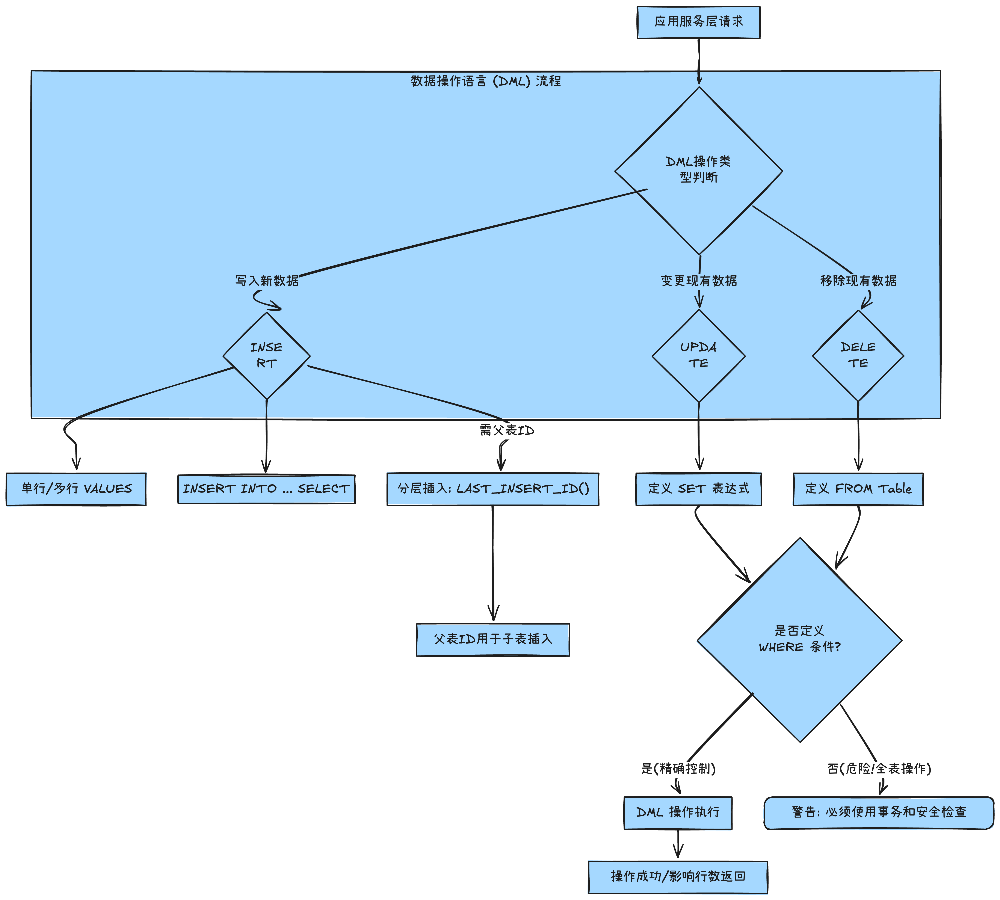

## SQL实战：DML核心操作深度解析——INSERT、UPDATE与DELETE的高效与安全实践

### 1. 简介

本文深入解析 SQL DML 的三大核心：INSERT、UPDATE 和 DELETE，并重点介绍如何利用 `LAST_INSERT_ID()` 处理分层插入、使用 `CREATE TABLE AS SELECT` 进行表归档，以及 DML 操作中子查询和 `WHERE` 子句的安全与效率考量。

------

### 2. 背景与问题定义

#### 本文解决的具体业务或技术问题

现代数据驱动型应用要求对数据库中的数据进行**精准、高效且安全**的增、改、删操作。这些操作是任何业务系统（如电商订单、客户管理、库存更新）的生命线。

#### 传统方案的局限性与真实场景

| **场景**               | **传统/错误方案局限性**                                      | **应对方案（本文核心）**                                     |
| ---------------------- | ------------------------------------------------------------ | ------------------------------------------------------------ |
| **订单创建（父子表）** | 手动查询最大 ID 或使用不安全的全局变量，在并发场景下会导致订单与订单项外键错乱。 | 利用 **`LAST_INSERT_ID()`** 函数在会话级别隔离地获取自增主键，保证数据原子性。 |
| **历史数据管理**       | 直接在业务主表上执行删除操作，或频繁使用 `DELETE` 清理归档数据，导致性能下降。 | 使用 **`CREATE TABLE AS SELECT`** 模式进行高效数据归档，结合 **`TRUNCATE TABLE`** 快速清空归档表。 |
| **数据批量修改/删除**  | 缺乏 **`WHERE`** 子句或条件过于宽松，容易导致全表数据被错误修改或删除，引发 P0 级事故。 | 严格使用 `WHERE` 子句定义操作范围，并利用子查询实现复杂的业务条件过滤。 |

### 3. 整体架构 / 逻辑流程（重点）

DML 操作的流程核心在于操作类型、操作对象与限制条件的定义。以下流程图突出数据操作的执行路径与关键的安全控制点。



**高层设计决策与关键路径：**

1. **WHERE 约束优先：** 无论是 `UPDATE` 还是 `DELETE`，`WHERE` 子句是第一道也是最关键的安全屏障。任何不带 `WHERE` 的操作都应被视为高风险操作。
2. **原子性保障：** 在处理分层数据（如主订单和订单项）时，采用 `LAST_INSERT_ID()` 机制，确保父子表数据在同一个事务和会话中保持逻辑上的原子性，避免数据孤儿。
3. **批量优化：** 尽可能使用批量 `INSERT` 或 `INSERT INTO ... SELECT` 结构，以最小化数据库连接和网络 I/O 开销，提升吞吐量。

### 4. 核心实现（按功能/概念模块组织）

#### 4.1. 数据插入（INSERT）与默认值处理

我们推荐使用显式列名列表的 `INSERT` 语法，这能确保代码对未来表结构（如新列的添加）拥有更强的鲁棒性。同时，可以利用 `DEFAULT` 关键字来显式地触发列的默认值或自增机制。

```sql
-- 推荐单行插入：只指定需要赋值的列
-- 权衡：可读性高，对表结构（列顺序）变化不敏感
INSERT INTO customers(
    first_name,
    last_name,
    birth_date,
    address,
    city,
    state
)
VALUES (
    'Join',
    'Smith',
    '1990-01-01',
    'address',
    'city',
    'CA'
);

-- 批量多行插入：单次网络往返，高效写入多条记录
-- 核心功能：减少通信开销，提升批量写入性能
INSERT INTO shippers (name)
VALUES
    ('Shipper1'),
    ('Shipper2'),
    ('Shipper3');
```

#### 4.2. 分层数据原子性插入：LAST_INSERT_ID()

在插入父子关系数据时，我们需要在父表（如 `orders`）插入成功后，立即获取其新生成的自增 ID，并将其作为外键插入到子表（如 `order_items`）中。

**实现要点：** `LAST_INSERT_ID()` 返回的是当前连接（会话）中最近一次成功 `INSERT` 操作产生的自增 ID，确保了数据关联的原子性和安全性，特别适用于高并发场景。

```sql
-- 步骤 1: 插入父表 orders，生成 order_id
INSERT INTO orders (customer_id, order_date,status)
VALUES (1, '2019-01-02', 1);

-- 步骤 2: 插入子表 order_items，利用 LAST_INSERT_ID() 关联父表 ID
-- 得到刚 insert 到 orders 记录的主键值 order_id，只适用于自增主键
INSERT INTO order_items
VALUES
    (LAST_INSERT_ID(), 1, 1, 2.35), -- 第一个值即是 order_id
    (LAST_INSERT_ID(), 2, 1, 3.95),
    (LAST_INSERT_ID(), 3, 1, 2.35);
```

#### 4.3. 表复制与数据归档：CREATE TABLE AS SELECT

在数据归档或报表场景中，需要从现有表复制结构或将数据迁移到新表。

**实现要点：**

1. **结构/数据复制：** `CREATE TABLE new_table AS SELECT ...` 高效复制数据和列定义。
2. **数据迁移：** `INSERT INTO target_table SELECT ...` 配合 `WHERE` 语句，可以实现按条件的数据归档。

```sql
-- 1. 创建 orders_archived 归档表，包含 orders 表的结构和数据
-- 架构思维：用于数据冷存储，提高主表性能，注意不复制索引和约束
CREATE TABLE orders_archived AS
SELECT *
FROM orders;

-- 2. 数据归档：将 2019 年以前的订单信息插入归档表
INSERT INTO orders_archived
SELECT *
FROM orders
WHERE order_date < '2019-01-01';

-- 3. 复杂归档与数据转换（将 ID 转换为 Name）
CREATE TABLE invoices_archived AS
SELECT
    i.invoice_id,
    c.name AS client, -- 关键：将 client_id 替换为 client_name
    i.invoice_total,
    i.payment_date
FROM invoices i
    LEFT JOIN clients c USING (client_id)
WHERE i.payment_date IS NOT NULL; -- 只归档已支付的发票信息
```

#### 4.4. 数据更新（UPDATE）

`UPDATE` 语句是修改数据的核心，它可以是针对单行、多行，也可以基于现有值进行计算更新。

```sql
-- 1. 单行更新与多字段赋值
UPDATE invoices
SET payment_total = 0, payment_date = NULL
WHERE invoice_id = 1;

-- 2. 基于计算的批量更新：给 1990 年以前出生的客户增加 50 积分
UPDATE customers
SET points = points + 50
WHERE birth_date < '1990-01-01';

-- 3. 使用 IN 关键字进行高效批量更新
UPDATE invoices
SET
    payment_total = invoice_total * 0.8,
    payment_date = due_date
WHERE client_id IN (3, 4); -- 更新 client_id 为 3 或 4 的发票
```

#### 4.5. 数据删除（DELETE）与子查询

**实现要点：** `DELETE` 必须与 `WHERE` 语句配合，否则后果严重。对于复杂的删除条件，应使用子查询来精确定义目标集合。

```sql
-- filepath: 4.9 delete.sql

-- 警告：DELETE FROM invoices; 将删除所有记录，请勿在生产环境执行！

-- 1. 精准删除：删除 id=1 的发票
DELETE FROM invoices
WHERE invoice_id = 1;

-- 2. 使用子查询进行复杂删除
-- 需求：删除客户名称为 'Myworks' 的所有发票信息
DELETE FROM invoices
WHERE client_id = (
    -- 子查询：先找到 'Myworks' 客户的 client_id
    SELECT client_id
    FROM clients
    WHERE name = 'Myworks'
);
```

### 5. 深度解析与技术要点

#### 5.1. LAST_INSERT_ID() 的会话隔离机制

`LAST_INSERT_ID()` 是数据库设计中的一个精妙权衡。它**不是**一个全局函数，而是**会话级别**的。这意味着无论有多少用户并发地执行 `INSERT` 操作，每个用户在调用此函数时，只能获取到自己在当前连接（会话）中最后一次成功插入操作所产生的自增 ID。

**权衡：** 它牺牲了获取最新 ID 的「全局性」，换取了在分布式和高并发系统下保证父子表数据完整性与原子性的绝对安全性。

#### 5.2. `UPDATE` 和 `DELETE` 中 `WHERE` 语句的重要性

`WHERE` 子句是 DML 语句性能和安全的核心。

- **安全：** 它是防止全表更新/删除（数据灾难）的唯一手段。
- **性能：** `WHERE` 条件应设计为能最大限度地利用表的索引。如果 `WHERE` 条件导致索引失效（例如在索引列上使用函数），数据库可能被迫进行全表扫描，将任何 DML 操作降级为性能瓶颈。

#### 5.3. `CREATE TABLE AS SELECT` 的局限性

虽然 CTAS 是快速备份和归档的利器，但其实现机制只复制了列定义和数据，**不会自动复制**源表中的主键、外键、索引、触发器和存储过程等高级对象。架构师在使用此功能后，必须手动补充这些约束，以确保新表的完整性。

### 6. 常见陷阱与调试建议

| **陷阱**                    | **描述**                                                     | **规避方法**                                                 |
| --------------------------- | ------------------------------------------------------------ | ------------------------------------------------------------ |
| **全表操作风险**            | `DELETE FROM table;` 或 `UPDATE table SET col = value;` 忘记添加 `WHERE` 导致灾难性后果。 | **安全准则：** 永远先写 `WHERE` 子句；在执行前，先用 `SELECT *` 配合相同的 `WHERE` 条件检查影响行数。 |
| **`LAST_INSERT_ID()` 误用** | 试图在不同的数据库连接中（如不同微服务）获取同一个 ID。      | `LAST_INSERT_ID()` 仅保证**当前会话**内的数据原子性。跨服务调用应通过 API 接口传递 ID。 |
| **数据类型截断**            | `INSERT INTO ... SELECT` 时，源表字段长度大于目标表字段，导致数据被截断。 | 在复制表结构时，确保目标列定义能够容纳源数据，或在 `SELECT` 时进行显式的数据类型转换。 |

**调试建议：**

- **SELECT 预览法：** 在编写复杂的 `UPDATE` 或 `DELETE` 语句时，先将其改写为 `SELECT * ... WHERE [你的条件]`，运行并检查返回的数据行，确保目标集正确无误，再替换为 DML 语句。
- **事务回滚：** 生产环境中的高风险操作，务必手动开启事务 (`START TRANSACTION;`)。在确认操作结果正确后，执行 `COMMIT;`；一旦发现错误，立即执行 `ROLLBACK;` 撤销所有操作。

### 7. 快速复习工具

**核心要点（8 条）：**

1. DML (Data Manipulation Language) 涵盖 `INSERT`、`UPDATE`、`DELETE`，是数据操作的核心。
2. 批量 `INSERT` 使用多组 `VALUES` 提升效率。
3. `LAST_INSERT_ID()` 保证分层数据插入（父子表）的会话级别原子性。
4. `CREATE TABLE AS SELECT` 可用于高效的表复制和数据归档，但需注意手动添加约束。
5. `TRUNCATE TABLE` 比 `DELETE FROM table` 更快，但无法回滚且不触发 DELETE 触发器。
6. `UPDATE` 支持基于字段当前值的计算更新，如 `SET points = points + 50`。
7. `UPDATE` 和 `DELETE` 语句中，`WHERE` 子句是安全与性能的绝对关键。
8. `DELETE` 语句可以通过子查询来定义复杂的删除条件集。

**闪卡/自检题（5 个）：**

1. 问：为什么在执行 `DELETE` 前，应该先执行 `SELECT COUNT(*)`？

   答：为了安全预览。确认 `WHERE` 子句圈定的目标集合大小是否符合预期，防止误删全表。

2. 问：如果一个表有自增主键，使用 `INSERT INTO table VALUES (...);` 时，主键位置应该放什么？

   答：应该放置 `DEFAULT` 关键字，让数据库自动生成或自增主键值。

3. 问：`CREATE TABLE AS SELECT` 复制表后，为什么新表通常不能立即投入生产使用？

   答：因为它没有复制主键、外键和索引等关键约束，需要手动定义。

4. 问：如何高效地更新某一批量 ID 集合的数据？

   答：使用 `UPDATE ... WHERE id IN (id1, id2, id3, ...)` 结构。

5. 问：在执行 `DELETE` 时，如何删除与另一张表有关联的数据？

   答：使用子查询 (Subquery) 在 `WHERE` 子句中定义删除的条件。

### 8. 进一步学习建议

- **进阶主题:** **视图（VIEW）** 的使用与维护、**存储过程（Stored Procedures）** 中 DML 的复杂逻辑封装、**ETL (Extract, Transform, Load)** 流程中 DML 的批量优化技术。
- **官方文档链接:** 查阅您所使用的数据库官方文档，重点关注 **"Concurrency Control" (并发控制)** 和 **"Transaction Management" (事务管理)** 部分。
- **建议学习路径:**
  - **架构安全：** DML 最佳实践与权限设计（Grant/Revoke）。
  - **性能调优：** 深入理解索引原理，以及如何编写避免索引失效的 `WHERE` 语句。
  - **高级 DML：** 学习 `MERGE/UPSERT` (如果数据库支持) 等结合 `INSERT` 和 `UPDATE` 的语句。