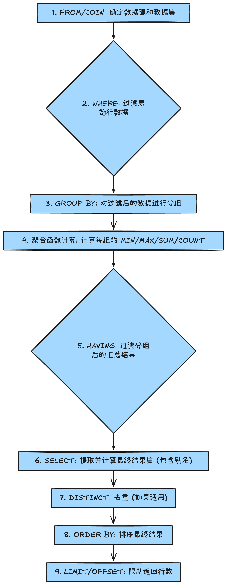

# SQL 深度指南：聚合、分组、过滤与超级汇总（GROUP BY, HAVING, ROLLUP）

#### 1. 简介

本文深入探讨 SQL 中用于数据汇总和分析的核心机制：聚合函数（Aggregate Functions）、分组操作（`GROUP BY`）、分组过滤（`HAVING`）及其高级汇总功能（`WITH ROLLUP`），帮助读者从海量数据中高效提炼商业价值。

#### 2. 背景与问题定义

**本文解决的**是商业智能（BI）和报表分析中的常见问题：如何从事务级（行级）数据中提炼出关键的**统计指标**（如总销售额、平均价格、最大值）。

- **传统方案的局限性：** 简单的 `SELECT` 语句只能返回原始行数据，或通过基本的聚合函数（如 `SUM()`）返回整个数据集的**唯一一个**汇总值。
- **真实场景：** 业务方需要的不是“所有客户的总销售额”，而是“**每个客户**的总销售额”、“**每个州/城市**的平均发票金额”。
- **为什么需要当前方案：** 当需要根据某一或多列属性（如 `client_id`、`state`）对数据进行切片（Slicing）后再进行聚合计算时，必须引入 `GROUP BY` 语句。此外，如果需要根据聚合计算的结果（例如“总销售额大于 $500 的客户”）进行二次筛选，传统的 `WHERE` 子句将无法满足要求，必须使用 `HAVING` 子句。

#### 3. 整体架构 / 逻辑流程（重点）

理解 `WHERE` 和 `HAVING` 的关键在于掌握 **SQL 查询的逻辑处理顺序**。SQL 语句并非按照书写顺序执行，而是一个固定的流水线作业。这个逻辑顺序是理解所有分组和过滤机制设计权衡的基础。



**高层设计决策与关键路径：**

1. **`WHERE` vs. `HAVING`：** `WHERE` 在 `GROUP BY` 之前执行，用于减少**行数**，不处理聚合结果。`HAVING` 在 `GROUP BY` 之后执行，用于减少**分组数**，因此可以引用聚合函数的结果（如 `SUM(amount) > 100`）。
2. **效率权衡：** 尽可能在 `WHERE` 子句中过滤数据，因为它作用于未分组的原始行，可以大幅减少传递给 `GROUP BY` 和聚合函数的数据量，从而提高查询性能。
3. **依赖关系：** `SELECT` 语句中所有非聚合列，如果不是常数，则必须出现在 `GROUP BY` 子句中，这是 SQL 语言关于函数依赖性的基本要求。

#### 4. 核心实现（按功能/概念模块组织）

我们将内容按逻辑功能分为三个模块：基础聚合、分组聚合和分组过滤。

##### 4.1. 聚合函数基础：一览表汇总

聚合函数作用于一列数据，返回单个汇总值。它们是所有分组分析的基础。

| **函数**         | **描述**                           | **特性**                              |
| ---------------- | ---------------------------------- | ------------------------------------- |
| `MAX()`, `MIN()` | 返回列中的最大值和最小值。         | 忽略 `NULL` 值。                      |
| `SUM()`, `AVG()` | 返回列的总和与平均值。             | **重要：** 它们会自动忽略 `NULL` 值。 |
| `COUNT(col)`     | 统计非 `NULL` 值的行数。           | 忽略 `NULL` 值。                      |
| `COUNT(*)`       | 统计总行数（包括所有 `NULL` 行）。 | 性能通常最优。                        |

完整可运行代码：基础聚合与表达式计算

此示例展示了如何在一份查询中计算多个指标，并使用表达式和 UNION 进行时间跨度的对比分析。

SQL

```sql
-- 核心功能：演示基础聚合函数和 NULL 值的处理
SELECT 
	MAX(invoice_total) AS highest_invoice,  -- 最大发票金额
    MIN(invoice_total) AS lowest_invoice,   -- 最小发票金额
    AVG(invoice_total) AS average_invoice,  -- 平均发票金额
    SUM(invoice_total) AS total_sales,      -- 总销售额
    COUNT(invoice_total) AS num_invoices_not_null, -- 统计 'invoice_total' 非 NULL 的记录数
    COUNT(payment_date) AS num_payments_made,      -- 统计 'payment_date' 非 NULL 的记录数 (已支付发票数)
    COUNT(*) AS total_records                      -- 统计所有记录数
FROM invoices;

-- 聚合函数内部可以使用表达式进行计算
SELECT 
    SUM(invoice_total * 1.1) AS total_sales_including_tax, -- 计算含税总销售额
    COUNT(*) AS total_records
FROM invoices
WHERE invoice_date > '2019-07-01'; -- WHERE 过滤原始行

-- 进阶：使用 UNION 比较两个时间段的聚合结果
SELECT 
	'First half of 2019' AS 'date_range',
	SUM(invoice_total) AS 'total_sales',
    SUM(payment_total) AS 'total_payments',
    ABS(SUM(invoice_total) - SUM(payment_total)) AS 'balance_due' -- 计算总应收账款和总已付金额的差值
FROM invoices
WHERE invoice_date BETWEEN '2019-01-01' AND '2019-06-30'
UNION
SELECT 
	'Second half of 2019' AS 'date_range',
	SUM(invoice_total) AS 'total_sales',
    SUM(payment_total) AS 'total_payments',
    ABS(SUM(invoice_total) - SUM(payment_total)) AS 'balance_due'
FROM invoices
WHERE invoice_date BETWEEN '2019-07-01' AND '2019-12-31';
```

##### 4.2. GROUP BY：分组聚合

`GROUP BY` 是实现按维度汇总的关键。它将具有相同值的行归入一个组，聚合函数将对每个组独立计算。

**完整可运行代码：多维度分组与 JOIN**

```sql
-- filepath: 5.2 groupby-statement.sql

-- 核心功能：计算每个客户的总销售额
SELECT 
	client_id,
    SUM(invoice_total) AS total_sales -- SUM 对 GROUP BY 后的每个 client_id 组独立计算
FROM invoices
WHERE invoice_date >= '2019-07-01' -- WHERE 在分组前过滤，只保留 2019 下半年的发票
GROUP BY client_id                  -- 按客户ID进行分组
ORDER BY total_sales DESC;          -- 对结果进行降序排列

-- 核心功能：查询每个州和城市（两级维度）的总销售额
SELECT 
	c.state,            -- 州
    c.city,             -- 城市
    SUM(i.invoice_total) AS total_sales
FROM invoices i
JOIN clients c USING (client_id) -- 关联客户表获取州和城市信息
GROUP BY c.state, c.city;        -- 必须同时包含 state 和 city 才能在 SELECT 中显示

-- 练习：查询每天通过不同支付方式（JOIN）的总收入
SELECT 
	p.date, 
	pm.name AS payment_method, -- 从支付方式表获取名称
    SUM(p.amount) AS total_payments
FROM payments p
JOIN payment_methods pm
ON p.payment_method = pm.payment_method_id -- 使用 ON 子句进行 JOIN
GROUP BY p.date, payment_method        -- 按日期和支付方式进行双重分组
ORDER BY p.date;
```

##### 4.3. HAVING：分组后过滤

`HAVING` 子句用于筛选那些已经通过 `GROUP BY` 分组和聚合计算产生的汇总结果，这是 `WHERE` 无法完成的任务。

**完整可运行代码：HAVING 联合 WHERE**

```sql
-- 核心功能：筛选发票总额大于500，且发票张数大于5的客户
SELECT 
	client_id,
    SUM(invoice_total) AS total_sales,
    COUNT(*) AS num_of_invoices
FROM invoices
GROUP BY client_id
HAVING total_sales > 500              -- HAVING 过滤聚合后的结果
	AND num_of_invoices > 5;           -- 可以引用 SELECT 列表中的聚合别名 (MySQL/PostgreSQL) 或聚合函数本身

-- 练习：结合 WHERE (预过滤) 和 HAVING (后过滤)
-- 目标：获取位于弗吉尼亚州 (VA) 且消费总额超过 $100 的客户
SELECT 
	c.customer_id,
	c.first_name,
    SUM(oi.unit_price * oi.quantity) AS spent_amount
FROM customers c
JOIN orders o USING (customer_id)
JOIN order_items oi USING (order_id)
WHERE c.state = 'VA' -- 步骤 1: WHERE 子句在分组前，只选择弗吉尼亚州的原始行
GROUP BY c.customer_id
HAVING spent_amount > 100; -- 步骤 2: HAVING 子句在分组后，只保留消费总额大于 $100 的分组
```

##### 4.4. ROLLUP：生成超级聚合（MySQL/部分数据库）

`WITH ROLLUP` 是 `GROUP BY` 子句的扩展，用于自动生成分层级的**超级聚合行**（Subtotals 和 Grand Total），极大地简化了报表和仪表盘的数据准备工作。

**完整可运行代码：ROLLUP 实现分级汇总**

```sql
use sql_invoicing;

-- 核心功能：计算每个州，每个城市的总销售额，并自动计算州的汇总和总计
SELECT 
	c.state, 
    c.city,
    SUM(i.invoice_total) AS total_sales
FROM clients c
JOIN invoices i USING (client_id)
GROUP BY c.state, c.city WITH ROLLUP; -- ROLLUP 关键字
-- 结果中，当 city 为 NULL 时，表示该行是该 state 的总销售额（Subtotal）
-- 当 state 和 city 都为 NULL 时，表示是所有数据的总销售额（Grand Total）
-- 注意：这些 NULL 并非是数据中的空值，而是 ROLLUP 标记的汇总行。

-- 练习：计算不同支付方式的总收入，并包含总计
SELECT 
	pm.name AS payment_method_name,
    SUM(amount) AS total_payment
FROM payments p
JOIN payment_methods pm
	ON p.payment_method = pm.payment_method_id
GROUP BY pm.name WITH ROLLUP; 
-- 关键要点：当使用 ROLLUP 时，GROUP BY 必须使用原始列名或表达式，不能使用 SELECT 列表中的列别名 'payment_method_name'。
```

#### 5. 深度解析与技术要点

##### 5.1. WHERE 和 HAVING 的设计权衡

- **性能考量：** `WHERE` 过滤的是基表原始数据，数据量大，但计算简单；`HAVING` 过滤的是聚合后的结果集，数据量小，但计算成本高（涉及聚合函数）。因此，应始终在 `WHERE` 中过滤尽可能多的原始数据，减轻后续 `GROUP BY` 和 `HAVING` 的负担。
- **不可替代性：** `WHERE` 无法引用聚合结果，而 `HAVING` 必须在分组后才能引用。它们在逻辑处理链中是串联且功能互补的。

##### 5.2. ROLLUP 的层次性与 NULL 标记

- **层次性：** `ROLLUP` 自动生成的是**有层次**的汇总。对于 `GROUP BY c1, c2, c3 WITH ROLLUP`，它会生成：`(c1, c2, c3)` 的分组、`(c1, c2, NULL)` 的分组、`(c1, NULL, NULL)` 的分组，以及 `(NULL, NULL, NULL)` 的总计。
- **NULL 的含义：** 在 `ROLLUP` 生成的汇总行中，分组列上的 `NULL` 值并非表示数据缺失，而是作为**汇总标记**。例如，当 `state` 为 'CA' 且 `city` 为 `NULL` 时，表示的是 'CA' 州所有城市的总计。
- **扩展性：** 许多现代 SQL 数据库（如 PostgreSQL, Oracle, SQL Server）提供了更灵活的 `GROUPING SETS` 和 `CUBE` 操作符，它们是 `ROLLUP` 的超集，可以定义非层次性的分组汇总。

#### 6. 常见陷阱与调试建议

| **陷阱**          | **描述**                                                     | **规避方法**                                                 |
| ----------------- | ------------------------------------------------------------ | ------------------------------------------------------------ |
| 非聚合列引用      | 在 `SELECT` 中引用了非聚合且不在 `GROUP BY` 中的列。         | 将该列添加到 `GROUP BY` 子句中，或对其使用聚合函数。         |
| `WHERE` 引用聚合  | 试图在 `WHERE` 子句中使用 `SUM()` 或 `COUNT()` 等聚合函数。  | 改用 `HAVING` 子句进行过滤，因为聚合计算发生在 `WHERE` 之后。 |
| `ROLLUP` 别名错误 | 在使用 `WITH ROLLUP` 时，`GROUP BY` 子句使用了 `SELECT` 列表中的列别名。 | `GROUP BY` 必须引用原始列名或列序号，而不能使用别名。        |
| `COUNT()` 错误    | 使用 `COUNT(column_name)` 统计时，未意识到它会忽略该列中的 `NULL` 值。 | 如果需要统计所有行，包括 `NULL` 行，应使用 `COUNT(*)`。      |

**调试建议：**

1. **分步调试：** 对于复杂的查询，先执行 `FROM` 和 `JOIN` 部分，确认数据源。再逐步添加 `WHERE`、`GROUP BY`，最后添加 `HAVING` 和聚合函数。
2. **检查 `GROUP BY`：** 确保 `SELECT` 列表中所有非聚合列都精确匹配 `GROUP BY` 列表中的列。
3. **使用 `NULL` 检查 `ROLLUP`：** 运行 `ROLLUP` 结果后，通过检查分组列中是否存在 `NULL` 值来确认汇总行是否正确生成。

#### 7. 快速复习工具

**核心要点（8 条）：**

1. 聚合函数（`SUM`, `AVG`, `MAX`, `MIN`, `COUNT`）用于将多行数据汇总为单行统计值。
2. `GROUP BY` 用于将数据集按一个或多个维度切片，使聚合函数针对每个切片独立计算。
3. 在 `SELECT` 列表中，所有非聚合列必须出现在 `GROUP BY` 子句中。
4. `WHERE` 子句在分组**之前**过滤原始行，不能引用聚合结果。
5. `HAVING` 子句在分组**之后**过滤分组结果，可以引用聚合函数。
6. 性能优化：应尽可能在 `WHERE` 中过滤数据，减少 `GROUP BY` 的数据处理量。
7. `COUNT(column_name)` 会忽略 `NULL` 值，而 `COUNT(*)` 计算所有行。
8. `WITH ROLLUP`（MySQL 扩展）用于自动生成分级汇总行（Subtotals 和 Grand Total），汇总行通过 `NULL` 标记。

**闪卡/自检题（5 个）：**

1. 问：`WHERE` 和 `HAVING` 在 SQL 逻辑执行顺序中有什么区别？

   答：`WHERE` 在 `GROUP BY` 之前执行，用于过滤原始行；`HAVING` 在 `GROUP BY` 之后执行，用于过滤分组结果。

2. 问：如果我想找出「平均发票金额超过 $20」的客户，应该使用哪个子句？

   答：必须使用 `HAVING`。因为「平均发票金额」是聚合结果。

3. 问：如果我想找出「发票日期在 2020 年之前」的客户，应该使用哪个子句？

   答：应该使用 `WHERE`。因为「发票日期在 2020 年之前」是原始行数据，过滤应在分组前进行。

4. 问：使用 `GROUP BY city, state WITH ROLLUP` 得到的 Grand Total 行，其 `city` 和 `state` 列的值是什么？

   答：两者都为 `NULL`，这个 `NULL` 是 `ROLLUP` 用来标记总计的特殊值。

5. 问：`COUNT(payment_date)` 和 `COUNT(*)` 之间最大的功能差异是什么？

   答：`COUNT(payment_date)` 只统计 `payment_date` 不为 `NULL` 的行，而 `COUNT(*)` 统计所有行。

#### 8. 进一步学习建议

- **Window Functions（窗口函数）：** 学习如何使用 `OVER (PARTITION BY ...)` 在不折叠行的情况下进行聚合计算（如计算每行相对于总和或平均值的百分比）。这是比 `GROUP BY` 更高级的分析工具。
- **高级分组操作：** 探索 `GROUPING SETS` 和 `CUBE` 操作符，它们在 SQL 标准中定义，比 MySQL 的 `ROLLUP` 提供更灵活和非层次性的分组汇总能力。
- **性能调优：** 深入学习 SQL 执行计划（Execution Plan）的解读，理解 `GROUP BY` 和聚合操作的内在成本，并学习如何通过索引优化分组查询。
