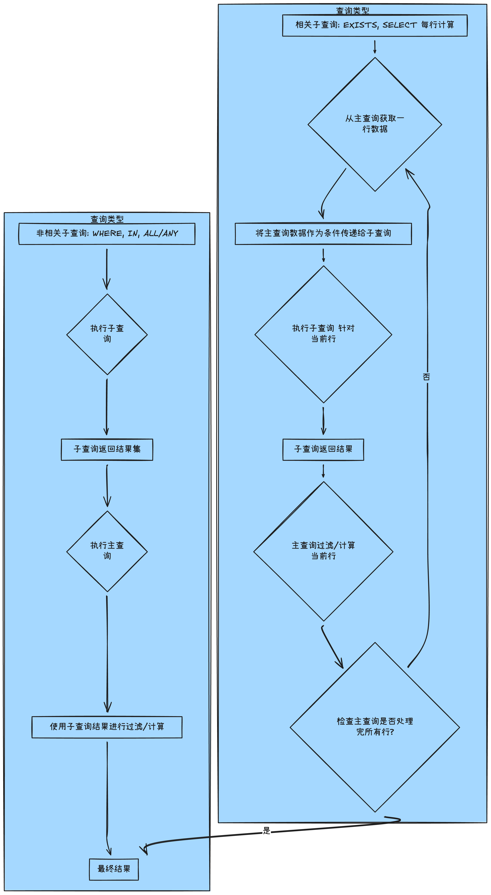

# 掌握 SQL 的终极武器：深度解析子查询（Subqueries）的设计哲学与实战技巧

## 1. 简介

本文旨在深入探讨 SQL 中的子查询（Subqueries）机制，该机制允许我们将一个 `SELECT` 语句嵌套在另一个 SQL 语句（如 `SELECT`, `INSERT`, `UPDATE`, `DELETE` 或另一个子查询）内部，从而实现复杂、多步骤的逻辑计算和数据过滤。我们将重点关注其在 `WHERE`、`SELECT` 和 `FROM` 子句中的灵活运用，以及与 `JOIN`、`IN`、`EXISTS` 等操作符之间的性能权衡。

## 2. 背景与问题定义

### 本文解决的具体技术问题

在数据查询中，我们经常遇到需要**基于动态计算结果**进行过滤、比较或聚合的场景。例如：

1. **动态比较**：查找价格高于「生菜」的**所有**产品。
2. **基于群组的相对比较**：查找薪水高于其**所在部门**平均薪水的员工。
3. **集合排除**：查找**从未**被订购过的产品。

### 传统方案的局限性

如果不使用子查询，解决上述问题通常需要采用**两步或多步查询**：

1. **分步查询**：首先执行一个查询（例如，计算平均薪水），然后在应用程序或客户端存储这个结果。
2. **二次查询**：将第一步的结果作为硬编码的值或参数代入到第二个查询中。

这种方法打破了数据操作的原子性，增加了应用程序端的逻辑复杂性、网络延迟，且代码可读性差。

### 为什么需要当前方案？真实场景

子查询的出现，使得数据库操作具备了**一步到位**的能力，将多步骤逻辑封装在一个单一的、可维护的 SQL 语句中。它将原本需要应用层处理的复杂依赖关系，转移到了数据库层高效执行，特别适用于以下场景：

- **动态阈值过滤**：使用子查询的结果作为主查询的过滤条件（如平均值、最大值）。
- **生成派生表 (Derived Tables)**：将子查询的结果视为一个临时表（在 `FROM` 子句中），以实现多阶段的数据处理。
- **行级别数据聚合**：在 `SELECT` 子句中计算与当前行相关的聚合值（例如，计算每个客户的总销售额）。

## 3. 整体架构 / 逻辑流程（重点）

子查询根据其与外部查询的依赖关系，可分为**非相关子查询 (Uncorrelated Subqueries)** 和 **相关子查询 (Correlated Subqueries)**。这是理解其执行逻辑和性能权衡的关键。

### 子查询执行逻辑架构



### 高层设计决策与关键路径

- **非相关子查询**：子查询独立于主查询执行，仅执行**一次**。其结果（可以是单个值、一列、或一个表格）被视为常量或集合，供主查询使用。这是效率最高的子查询类型。

- **相关子查询**：子查询的执行依赖于主查询当前正在处理的行中的值。这意味着子查询可能需要针对主查询的**每一行**执行一次，性能开销显著大于非相关子查询。

## 4. 核心实现（按功能/概念模块组织）

### 4.1. WHERE 子句中的基础过滤与比较

这是子查询最常见的应用，用于在外部查询中应用动态的过滤条件。子查询返回的结果必须是**单个标量值 (Scalar Value)** 或 **一列值 (Set)**。

**模块标题：动态标量比较**

查找薪水高于公司平均薪水的员工。

```sql
USE sql_hr;

-- 核心功能：查找薪水高于平均水平的员工
SELECT 
    *
FROM 
    employees
WHERE 
    salary > (  -- 主查询的过滤条件依赖于子查询的动态结果
        SELECT 
            AVG(salary)  -- 子查询必须返回一个单一的（标量）值
        FROM 
            employees
    );

-- 实现要点：
-- 1. 子查询首先被执行，计算出所有员工的平均薪水。
-- 2. 主查询随后执行，利用这个平均薪水值进行行级别的过滤。
```

### 4.2. 集合操作：IN / NOT IN 的运用

当子查询返回**一列多行**的结果集时，我们使用 `IN` 或 `NOT IN` 操作符来检查主查询中的值是否属于该集合。

**模块标题：集合匹配与排除**

查找从未被订购过的产品。

```sql
USE sql_store;

-- 方案一: 使用 NOT IN 排除已订购的产品
SELECT 
    product_id,
    name
FROM 
    products 
WHERE 
    product_id NOT IN ( -- NOT IN 关键字用于检查产品ID是否在子查询返回的集合中
        SELECT DISTINCT product_id -- 子查询返回所有被订购过的产品ID集合
        FROM order_items
    );

-- 方案二 (作为对比): 使用 LEFT JOIN
SELECT 
    p.product_id,
    p.name
FROM 
    products p
LEFT JOIN 
    order_items oi USING(product_id) -- 尝试连接订单项
WHERE 
    order_id IS NULL; -- 订单ID为NULL，说明产品从未出现在订单项中
    
-- 实现要点：
-- NOT IN 方案语义清晰，但需注意 NULL 值陷阱（详见陷阱模块）。
-- LEFT JOIN 方案在多数数据库中通常有更好的性能优化。
```

### 4.3. 相关子查询 (Correlated Subqueries)

相关子查询是主查询和子查询之间存在依赖关系的查询。它在处理**组内比较**等逻辑时非常强大。

**模块标题：组内动态平均值比较**

查找薪水高于其**所在办公室**平均薪水的员工。

```sql
USE sql_hr;

SELECT 
    *
FROM 
    employees e  -- 主查询定义别名 e
WHERE 
    salary > (
        SELECT 
            AVG(salary)
        FROM 
            employees
        WHERE 
            office_id = e.office_id -- 子查询引用了主查询的列 (e.office_id)
    );

-- 实现要点：
-- 1. 对于主查询中的每一行员工 (e)，子查询都会被重新执行。
-- 2. 子查询根据当前员工 e 的 office_id 动态计算该办公室的平均薪水。
-- 3. 主查询使用这个动态计算的平均值来判断当前员工的薪水是否更高。
-- 4. 这种依赖性使得子查询能够实现行级别的复杂逻辑。
```

### 4.4. EXISTS / NOT EXISTS 存在性检查

`EXISTS` 和 `NOT EXISTS` 关键字用于检查子查询是否返回**至少一行**数据。它不关心子查询返回的具体内容，只关心「是否存在」。

**模块标题：存在性判断与优化**

查找有发票的客户（即客户在 `invoices` 表中至少有一条记录）。

```sql
USE sql_invoicing;

-- 使用 EXISTS 关键字检查发票是否存在
SELECT 
    client_id,
    name
FROM 
    clients c
WHERE 
    EXISTS ( -- 检查子查询是否返回任何行
        SELECT 
            1  -- 习惯上写 1，因为不关心返回列，只要有行即可
        FROM 
            invoices i
        WHERE 
            i.client_id = c.client_id -- 这是一个相关子查询
    );

-- 实现要点：
-- 1. 这是一个相关子查询。
-- 2. 一旦子查询找到第一个匹配的发票记录，它会立即停止扫描并返回 TRUE，效率很高。
-- 3. 相比 IN 或 JOIN，EXISTS/NOT EXISTS 在处理大量数据且只需要判断「存在」时，通常具有性能优势。
```

### 4.5. SELECT 和 FROM 子句中的子查询

子查询不仅可以用于过滤（`WHERE`），还可以用于投影（`SELECT`）和构建临时数据集（`FROM`）。

**模块标题：派生列与临时表**

在发票列表中，增加一个列来显示所有发票的平均总额以及当前发票与平均值的差额。

```sql
USE sql_invoicing;

-- SELECT 子句中的子查询 (必须是标量子查询)
SELECT 
    invoice_id,
    invoice_total,
    (SELECT AVG(invoice_total) FROM invoices) AS avg_invoice, -- 在 SELECT 中计算全局平均值
    invoice_total - (SELECT AVG(invoice_total) FROM invoices) AS difference
FROM 
    invoices;
    
-- FROM 子句中的子查询 (派生表 / Inline View)
SELECT 
    *
FROM 
    (
        -- 核心逻辑：计算每个客户的总销售额、平均销售额、差异
        SELECT
            client_id,
            name,
            (SELECT SUM(invoice_total) FROM invoices WHERE client_id = c.client_id) AS total_sales,
            (SELECT AVG(invoice_total) FROM invoices) AS average,
            (SELECT SUM(invoice_total) FROM invoices WHERE client_id = c.client_id) - (SELECT AVG(invoice_total) FROM invoices) AS difference
        FROM 
            clients c
    ) AS sales_summary -- 必须为 FROM 子句中的子查询指定别名 (sales_summary)
WHERE 
    total_sales IS NOT NULL; -- 可以在外部查询中过滤临时表的结果

-- 实现要点：
-- 1. SELECT子查询：非相关子查询只执行一次，返回的标量值被「投影」到每一行。
-- 2. FROM子查询：子查询的结果被视为一个临时表，可以在外部查询中像普通表一样进行 SELECT/WHERE 操作，有助于提高复杂查询的可读性。
```

## 5. 深度解析与技术要点

### 5.1. IN, EXISTS, JOIN 的性能哲学与权衡

在处理集合检查时，`IN`、`EXISTS` 和 `JOIN` 都可以实现类似功能，但底层机制和性能表现存在显著差异：

| **机制**   | **逻辑原理**                                                 | **典型性能表现**                                             | **最佳适用场景**                                     |
| ---------- | ------------------------------------------------------------ | ------------------------------------------------------------ | ---------------------------------------------------- |
| **IN**     | 返回一个集合，然后逐行检查主查询的值是否**包含**在集合中。| 适用于子查询结果集较小的情况。如果集合过大，内存开销和查找时间会增加。| 子查询返回少量（数百个以内）的确定性值。|
| **JOIN**   | 通过连接键将两个表合并。对于集合排除 (`NOT IN` 或 `NOT EXISTS`)，通常使用 `LEFT JOIN... WHERE NULL`。| 数据库对 JOIN 操作有高度优化的算法（如 Hash Join, Merge Join），通常在处理大型数据集时效率很高。| 数据集规模大，或需要返回子查询中的额外列。|
| **EXISTS** | 属于**相关子查询**。一旦子查询返回**第一行**，即刻停止扫描并返回 `TRUE`。| 效率极高，尤其适合只判断「存在性」的场景。对于 `NOT EXISTS`（不存在），可以有效地找出未匹配的记录。| 只需要判断记录是否存在，且子查询可以快速定位匹配项。|

**设计权衡**：在排除场景中（如 `NOT IN` vs `NOT EXISTS` vs `LEFT JOIN IS NULL`），由于 `EXISTS` 的短路特性，`NOT EXISTS` 往往是更安全和高效的选择，因为它能避免 `NOT IN` 处理 NULL 值时的陷阱 5。

### 5.2. ALL / ANY 关键字的语义强化

`ALL` 和 `ANY` (或 `SOME`) 关键字用于将主查询的标量值与子查询返回的**集合**中的所有/任一元素进行比较 6。

- `> ALL (...)`：主查询的值必须大于子查询返回集合中的**最大值** (`> MAX()`)。
- `< ALL (...)`：主查询的值必须小于子查询返回集合中的**最小值** (`< MIN()`)。
- `= ANY (...)`：等价于 `IN (...)`，主查询的值等于集合中的**任一**值。
- `> ANY (...)`：主查询的值必须大于集合中的**最小值** (`> MIN()`)。

它们的主要价值在于**增强查询的可读性和意图表达**，在特定场景下可替代聚合函数。

### 5.3. SELECT 子句别名限制

在 `SELECT` 子句中，同一个查询块中定义的列别名不能直接用于后续的列计算 7。

例如，以下代码在某些 SQL 环境中会报错或行为异常：

SQL

```go
SELECT 
    invoice_total,
    (SELECT avg(invoice_total) FROM invoices) AS avg_invoice,
    invoice_total - avg_invoice AS difference -- 错误：无法直接引用 avg_invoice
FROM invoices;
```

**正确做法**是重复子查询（或在不支持的情况下使用派生表）。

## 6. 常见陷阱与调试建议

| **陷阱**                | **描述**                                                     | **规避方法**                                                 |
| ----------------------- | ------------------------------------------------------------ | ------------------------------------------------------------ |
| **标量子查询返回多行**  | 在 `WHERE` 或 `SELECT` 子句中，如果预期返回单个值的子查询实际返回了多行，数据库会抛出错误。| 确保子查询使用 `MAX()`, `MIN()`, `AVG()` 等聚合函数，或在 `WHERE` 子句中添加限制，确保结果唯一。|
| **`NOT IN` 与 NULL 值** | 如果 `NOT IN` 的子查询返回结果集包含任何 `NULL` 值，则整个主查询将返回空集。这是因为 `X NOT IN (..., NULL,...)` 无法确定，最终结果为 `UNKNOWN`。| 避免在子查询中返回 `NULL`，或使用 `NOT EXISTS` 代替 `NOT IN` 进行集合排除。|
| **相关子查询性能低**    | 针对主查询的每一行执行一次子查询，导致查询速度随着数据量增加而急剧下降。| 优先考虑使用 `JOIN` 或**窗口函数 (Window Functions)** 来替代相关子查询。|

### 调试建议

1. **分步隔离调试**：对于复杂嵌套的子查询，应始终从最内层子查询开始，逐步向外执行，验证每一步返回的结果集是否符合预期。
2. **使用 `EXPLAIN` 检查执行计划**：对于性能低下的查询，使用数据库的 `EXPLAIN` (或 `EXPLAIN PLAN`, `DESCRIBE`) 命令来查看优化器是如何处理子查询的。重点检查是否强制使用了**相关子查询**，这通常是性能瓶颈所在（标注：此命令为数据库工具而非 OS 命令）。
3. **临时表替代 FROM 子查询**：如果 `FROM` 子句中的子查询过于复杂，可以考虑先将其结果存储为一个临时表（`CREATE TEMPORARY TABLE... SELECT...`），再对临时表进行操作，以简化调试流程。

## 7. 快速复习工具

### 核心要点（8 条）：

1. **子查询定义**：是嵌套在其他 SQL 语句中的 `SELECT` 语句，用于处理动态和中间结果集。
2. **标量子查询**：返回单个值，可用于 `WHERE` 或 `SELECT` 子句进行直接比较或投影。
3. **集合子查询**：返回一列多行，常与 `IN`/`NOT IN`、`ANY`/`ALL` 配合使用。
4. **相关子查询**：子查询的执行依赖于主查询的当前行，每行执行一次。
5. **`EXISTS` 优势**：适用于存在性检查，因其「短路」特性，在特定场景下性能优于 `IN` 或 `JOIN`。
6. **`FROM` 子查询**：被称为派生表或内联视图，必须指定别名，用于构建临时工作数据集。
7. **性能权衡**：对于集合操作，通常优先考虑 `JOIN`，其次是 `NOT EXISTS`，最后是 `NOT IN`（因 NULL 陷阱）。
8. **替换思路**：相关子查询往往可以通过窗口函数（如 `AVG() OVER(PARTITION BY...)`）来优化，实现更高的效率。

### 闪卡/自检题（5 个）：

1. 问：`SELECT` 子句中的子查询和 `WHERE` 子句中的子查询，最核心的区别是什么？

   答：`SELECT` 子句中的子查询（除非是相关子查询）通常只执行一次，结果被「投影」到所有行；`WHERE` 子句的子查询结果用于过滤。两者都必须是标量或集合。

2. 问：为什么说 `NOT EXISTS` 通常比 `NOT IN` 更安全？

   答：因为 `NOT IN` 的子查询如果返回结果集中包含 `NULL` 值，会导致整个主查询结果为空，而 `NOT EXISTS` 不受 `NULL` 值影响。

3. 问：什么是相关子查询？它与非相关子查询的主要性能差异在哪里？

   答：相关子查询会引用主查询中的列，需要针对主查询的每一行数据重新执行一次，性能开销比非相关子查询（只执行一次）大得多。

4. 问：在 `FROM` 子句中使用子查询时，必须遵守的语法规范是什么？

   **答**：必须为该子查询的结果集（即派生表）指定一个别名，否则会引发语法错误。

5. 问：如何用 `ALL` 关键字找到发票总额大于客户 3 所有发票总额的记录？

   **答**：`SELECT * FROM invoices WHERE invoice_total > ALL (SELECT invoice_total FROM invoices WHERE client_id = 3)`。

## 8. 进一步学习建议

子查询是构建复杂数据模型的基础，但为了追求更高的性能和更简洁的代码结构，以下是推荐的进阶学习路径：

- **窗口函数 (Window Functions)**：这是 SQL 3999 标准引入的强大特性，可以极大地简化和优化相关子查询所处理的「组内计算」问题（如计算部门平均值）。它是替代相关子查询的最佳实践。
- **公共表表达式 (CTE, Common Table Expressions)**：使用 `WITH` 关键字定义，可以提高复杂查询的可读性、可维护性和复用性，特别是在需要多次引用同一个子查询结果或处理递归查询时。
- **SQL 优化器原理**：了解不同数据库（如 MySQL, PostgreSQL, SQL Server）的查询优化器如何将子查询重写为 `JOIN` 或其他更高效的操作，有助于编写出更容易被优化的 SQL 代码。
